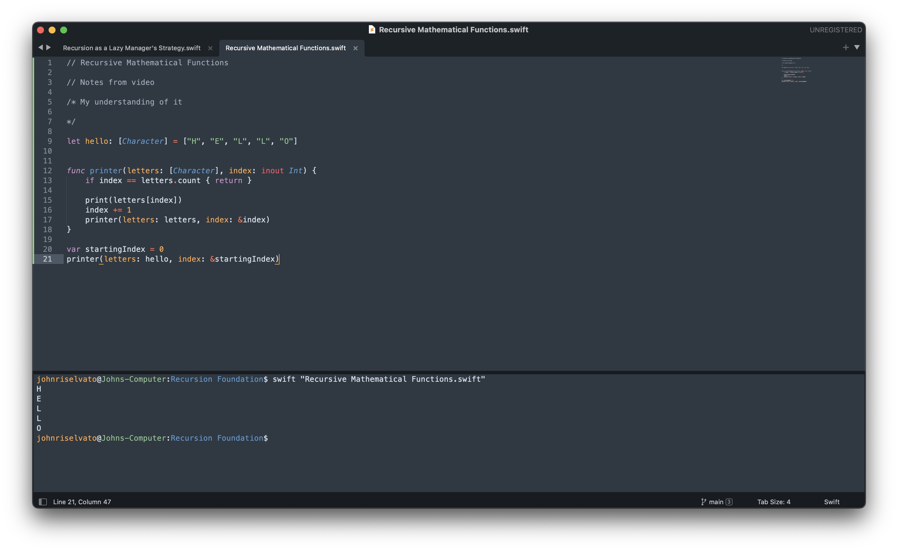

# About

I've been programming with vim and xcode for so long, I have missed how beautiful another IDE can be. As I configure Sublime to fit my needs, I'll update this file.

## Packages
1. Terminus - terminal
	- make sure you run `Terminus Utilities: Generate User Theme` to copy the Sublime theme

## Configurations

#### Sublime Text -> Preferences -> Settings

```
{
	"color_scheme": "Mariana.sublime-color-scheme",
	"font_size": 13,
	"ignored_packages":
	[
		"Vintage",
	],
	"theme": "Adaptive.sublime-theme",
	"caret_extra_bottom": 0,
	"caret_extra_top": 0,
	"caret_extra_width": 0,
	"open_files_in_new_window": false,
	"word_wrap": true,
	"scroll_past_end": true,
}
```

#### Sublime Text -> Preferences -> Key Bindings

```
[
	// Fix copy and paste indenting
	{ "keys": ["super+shift+v"], "command": "paste" },
	{ "keys": ["super+v"], "command": "paste_and_indent" },
]
```


