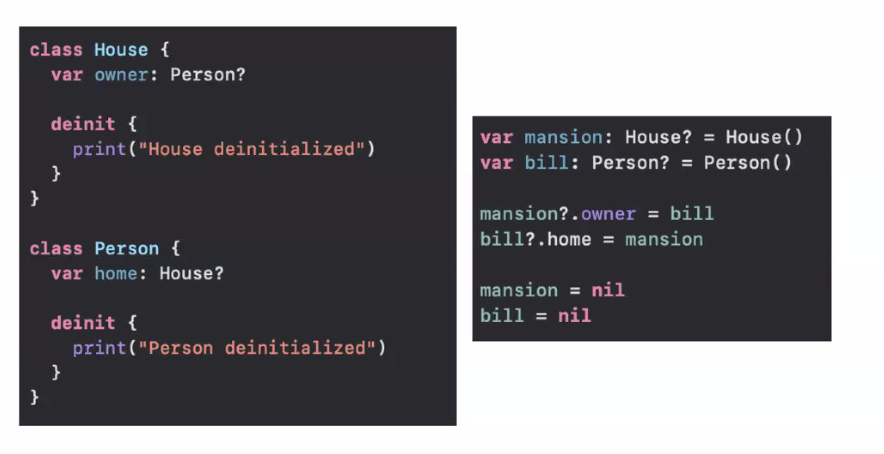
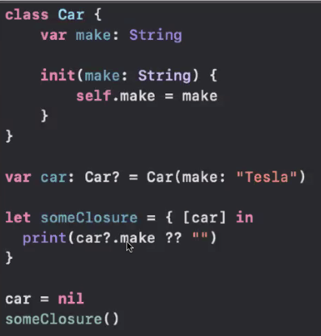
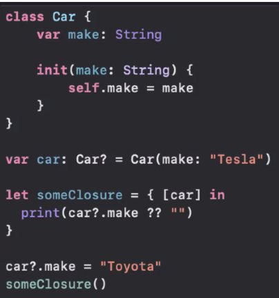
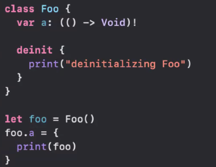

# Data Persistence and Troubleshooting Assignment Review with Nishil

Q. by default, objects in swift are initialized with ___ references:
A. strong

---

Q. What is the defference between weak and unowned reference types?
A. `weak` is optional. `unowned` has to have an initial value

---

Q. What is the output of the following code?

A. This is a circular retain circle. neither will print

---

Q. How would you fix the retain cycle in the above code?
A. Set one of them weak or unowned

---

Q. What is the output of this code?

A. prints the car name (tesla)

---

Q. What is the output of this code?

A. Print Toyota

---

Q. What is the output of this code?

A. Print's Tesla

---

Q. What is wrong with this code?

A. should be `weak` closure init

---

Q. Benefits of NSCache

- releases object if memory warning
- life cycling
- thread safe

---

Q. How do you unit test asynchronous behavior?

- closures
- bindables

---

Q. In what situation would a code block not cause a retain cycle (without using weak/unowned)?

- UIView.animation

