# Data Persistence and Troubleshooting Live Class with Anish

**Q** What is Data persistence?
**A.** Retaining some info and accessing that information later
	- maybe sessions so lasts 

**Q.** Why do we persist data?
**A.**

- A better user experience (responsive UI, less loading, less user input)
- Efficiently use resources (network bandwidth, server requests)
- Build features
- Collect analytics
- Offline mode

# General iOS interview Formats

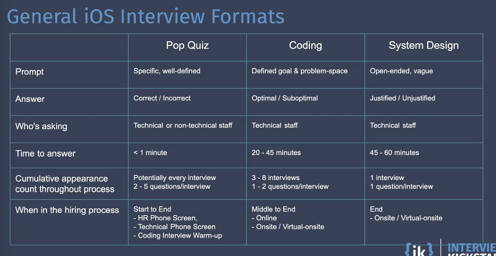

- we should know why each variation exists
- pros and cons

# Different types:

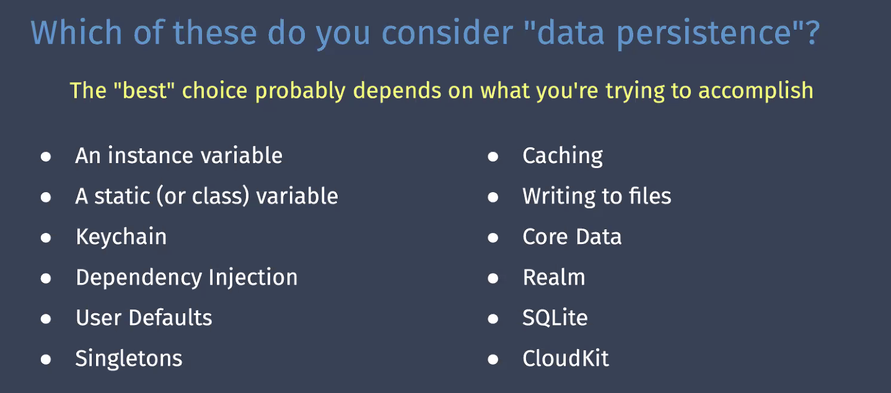

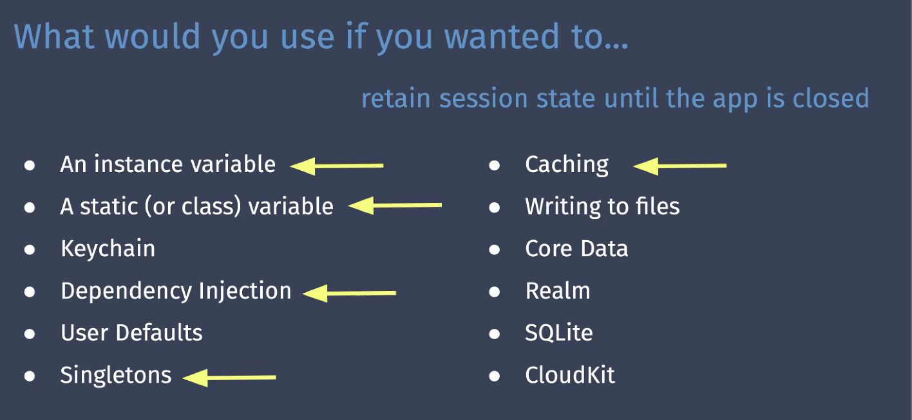

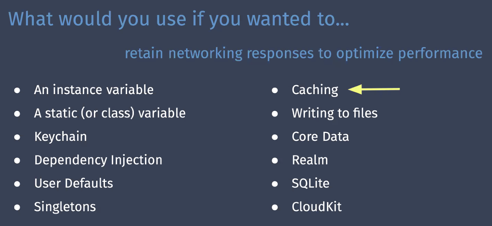

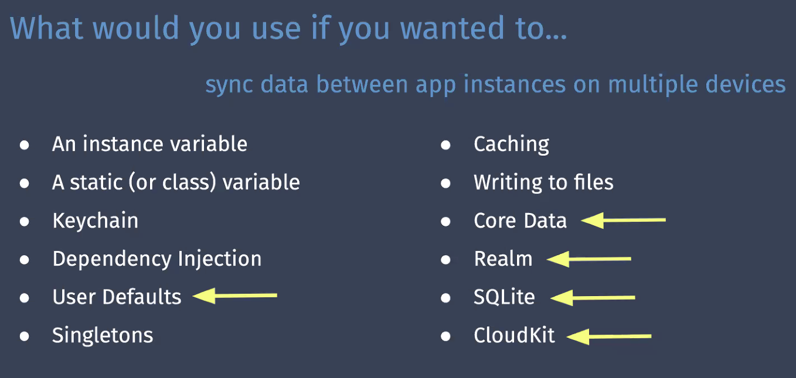

+ keychain: tokens and user info

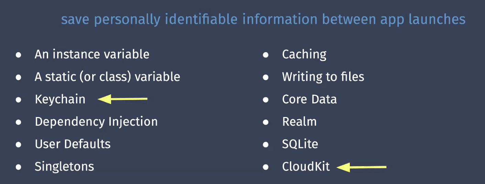

- (PII) personally identifiable information

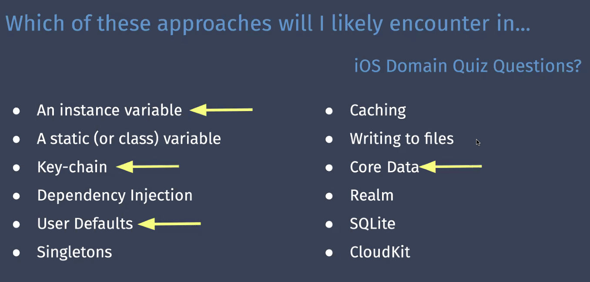

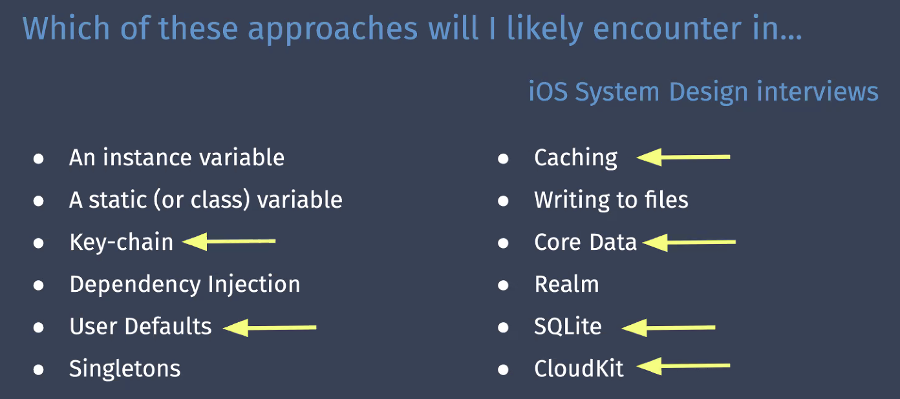

- Never talk about cocoapods over native solutino for persistence

# User defaults

- never suggest NSObjects or NSArrays
	- due to serialization and deserialization, it's very expensive to store with large data
- only can store plist (bool, strins, ints, etc) and small data
- no encryption or cross device sharability
- is available at app updates

# Keychain

- stores **small quantities** of user data in an **encrypted** db
- important part is encryption
- PIIs
- can be used to share login between mutliple apps
- Apps can configure the conditions by which its keychain items may be accessed.
	- example:
		- by default keychain items are accessible when the device is unlocked
- How might a developer further secure keychain items?
	- Double encrypt 
	- but let Apple handle

### What to keep in mind of pop quiz:

1. it saves user data in an encrypted database
2. it is slow to access
3. requires app to unlock

# Core data

- is available at app updates
- saving permanent data for offline user
- cache temporary data
- add "undo/redo" functionality
- on top of sqlite
- Examples:
	- notes app is handled by core data

### Strengths

- Asynchronous out of the box
	- removes main thread task
- Supports listview `data source` protocols
- versioning migration
- if implemented with CloudKit
	- can automatically mirror your data model in CK to they sync data across multiple devices associated with an iCloud account
- Store large amount of data
- Most commonly used as a local db

### Limitations

- Maybe overkill depending on the solution
- no encryption

---

Apple wants us using Core Data for everything hence the iCloud connection

# Write to "File"

- interact with the device file system
- most interactions utilize the fileManager class to access and manipulate files on the device

**Q.** Why might a developer choose to access/manipulate files directly versus using core data?
**A.**

- it exists - a lot of time candidates forget this data persistence approach
- it's a decent way to store large amount of data
	- audio / video files

# CRDTs - Conflict-free replicated data type

- new data model for sync and persistence
- ie, google docs

# System design

- candidate should be familiar with:
	- benefits / challenges
	- offline storage
		- persistent cache vs local database
	- data models
	- basic API design

## Benefits of local database

- Snappy UI **
- Able to function in poor network conditions
- Fewer client-server round-trips

## Challenges of local database

- synchronization
	- multi-user / Multi-device leads to race conditions
		- conflict resolution
	- Sync strategies
		- retry strategy
	- request that shouldn't be retried
		- idempotent API endpoints
- server is source of truth

## Offline Storage 

**Q:** What are you persisting locally?

- a clone of some remote database(s)
	- this is certainly what i observe most as an interviewer
	- i would not say this approach is over-used by candidates
		- but there are limitations to this approach
- a persistent cache of client server "transactions"
	- post mutation commands to the persistent cache (core data)
	- handle each command
	- receive actions for the server
		- replace immutable models
		- drive UI changes

When creating an API

- stick to CRUD
	- create / read / update / delete

## Frequent System Design prompt

**"MAKE AN OFFLINE FEATURE"**

the subtile complexity comes from considering:

- keeping client in-sync with remote data source
- dealing with conflicts
- network availability and quality
- retry strategies

# iOS domain knolwedge questions

What options are available to persist data on iOS

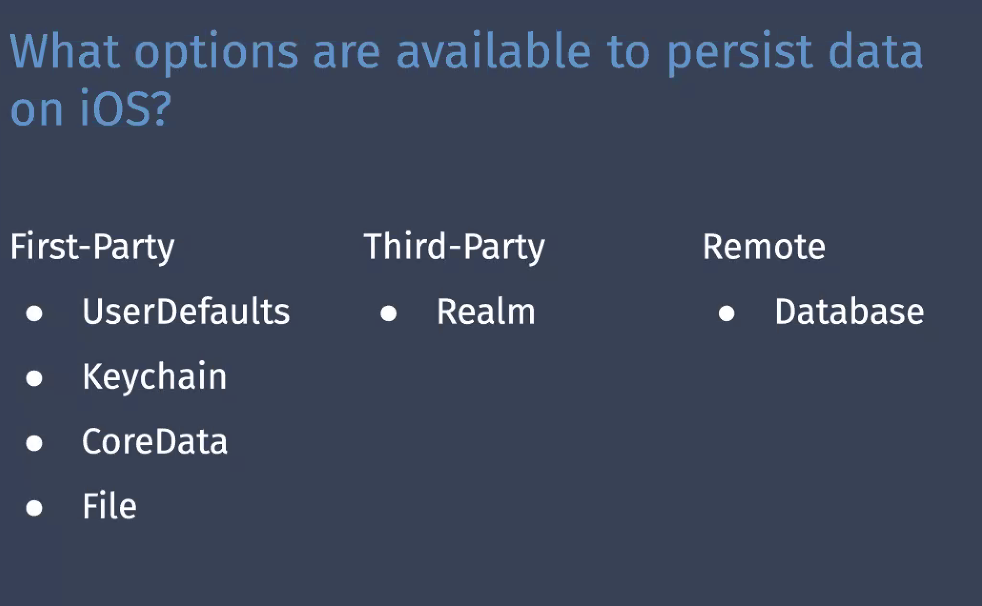

---

# Create an offline feature for a chatting app

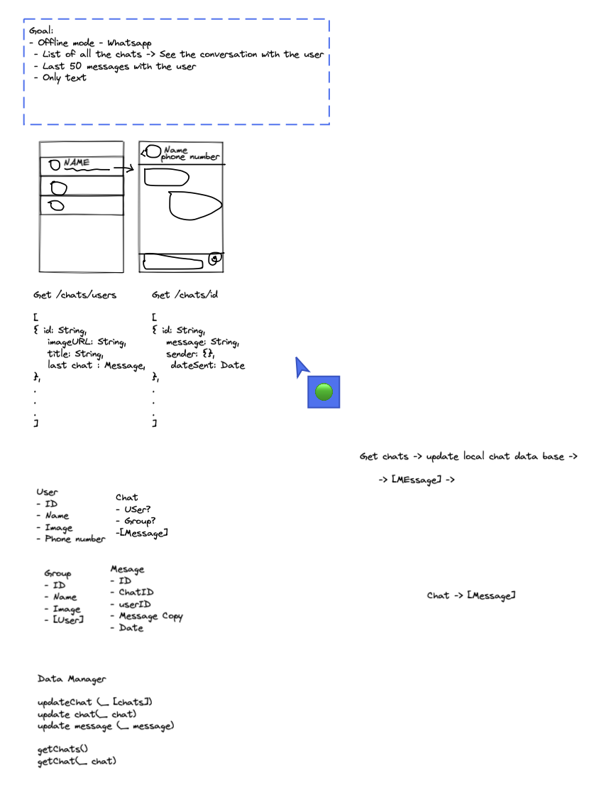

https://excalidraw.com/#room=e05bd6c00407f111a302,KB160qVUxxOQJ_sjs-qqCw

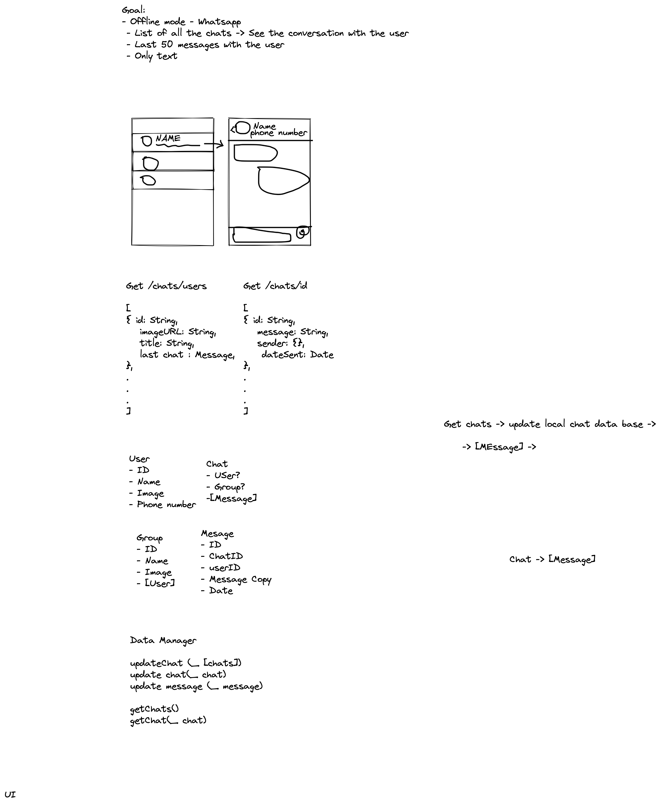
