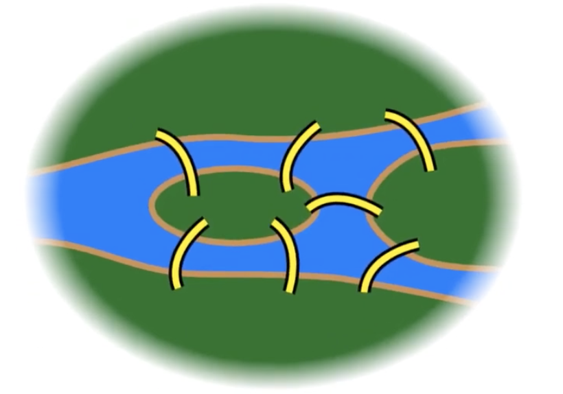

# Problem definition Seven Bridges of Konigsberg

How graph theory invented?
- a person, a place, a problem and a paper
- 1736: Prussian empire

### Can one walk across the seven bridges without crossing the same bridge twice?

Euler thought it was unworthy of his mathmatic skills as it wasn't a geometry, no algebric or counting related. 

He turned the problem into a graph based on land regions connected by edges (bridges)

