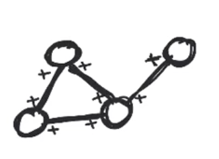
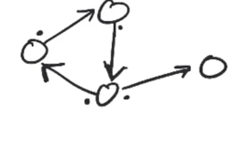

# Graphs

## Degree

A degree of a vertix is th enumber of edges it has

```
[2] --- [1]
 |
 |
[1]
```

## Sum of the degrees of a vertex


### The sum of degrees for an undirected graph

**Q:** The sum of the degrees of all the vertices in an undirected graph G = (V, E) is:

**A:** 2|E|

	- because you count each edge connected to a vertices. It seems each edge is counted tice:



### The sum of degrees for a directed graph

There are two different type of degrees for a directed graph:
1. out-degree
2. in-degree

In this example:



- Out-degree: we are only counting each edge once from where the edge starts from (where the dots are) or |E|
- In-degree: we are only counting the edges ending on a vertix. but it is also |E|

note: |E| is the number of edges

----

**Q:** An undirected airport graph has 200 airports, and each airport has a direct flight connection to at least 5 other airports. Which of the following is the most precise statement we can make about the number of edges?

**A:** |E| is at least 500
	If we add up the degrees of all vertices, that value would be at least 200 X 5 = at least 1000. So the number of edges must be at least 1000/2 = 500. 

## Eulerian Cycle Construction

- A connected graph has an Eulerian cycle if and only if the degree of even vertex is even.
	- And if we are trying to figure out that cycle, we can use backtracing to figure out the cycle.
- Eulerian Cycle start and end at the same point

## Eulerian Path Problem

Note: There's some rules here that are important.

**Q:** What are the two types of Eulerian paths?
1. Eulerian Cycle - a path that starts and ends on the same vertices
2. Eulerian Path - start and end at two different vertices

### Valid Eulerian Paths

- Must start and end of on odd degree vertex. Why?
	- because it needs an edge to exit and return on. There needs to be an available edge to use

**Q:** Is it possible for a graph to have a single vertex with an odd degree?
No because even if it has odd degree, the edges would add odd degrees to another connection.

```
			A
		  / | \
		 B  C  D

```
^ has 4 vertex with odd degrees not single

Also Degree(v) = 2|E| which is always even

**Q:** If a connected graph has exactly 2 vertices with an odd degree, will a Eulerian path exist? 
**A:** Yes, because the start and end must be on odd degree vertex.

## Conclusion by Euler

A poem:

Some citizens of Königsberg Were walking on the strand Beside the river Pregel
With its seven bridges spanned.
“O Euler, come and walk with us,” Those burghers did beseech. “We’ll roam the seven bridges o’er, And pass but once by each.”
“It can’t be done,” thus Euler cried. “Here comes the Q.E.D.
Your islands are but vertices
And four have odd degree.”

	- William T. Tutte

