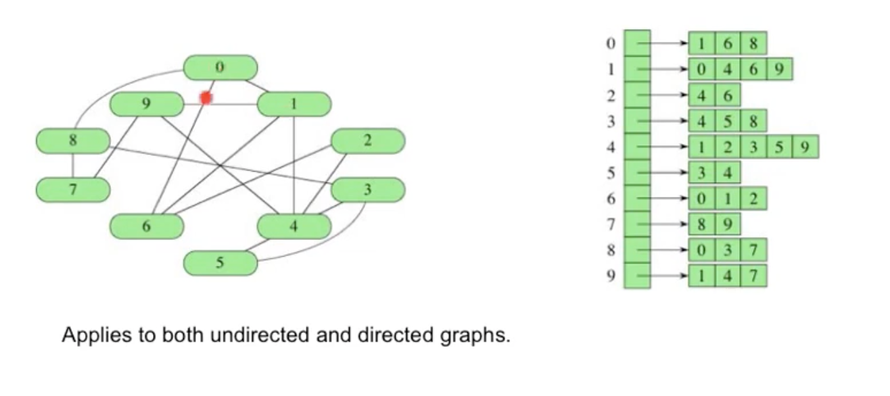
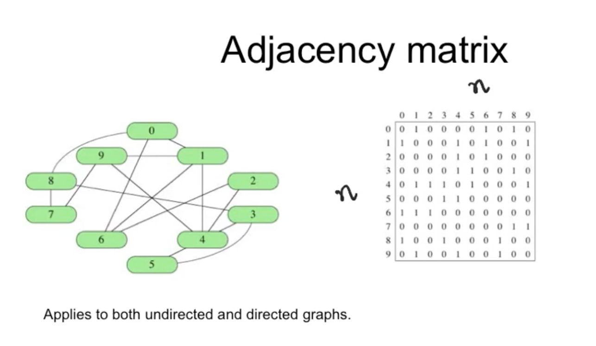
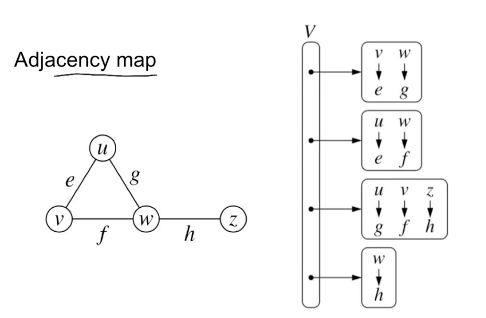

## Edge Lists

- Store data in an array or as a hashmap
- Edges are stored in an unordered list

Time / Space complexity: O(n*m)

## Adjacency List



- index as integer or hashmap

## Adjacency Matrix



- If the graph is `undirected` the graph will be symetric
- if the graph is `directed` wont be

## Adjacency Map



- uses dictionary (hash table) to store the neighbors of the vertex (v), instead of a list of neighbors (as in adjacency list)

## Pseudocode Implementation

# Adjacency list implimentation

## Creating a graph:

```
class Graph {
	var adjList = [LinkList<Int>]() // linked list of integers
	var v: Int?

	func graph(size: Int) {
		v = size
		adjList = Array<Square?>(count: v, repeatedValue: nil);
	}

}

```


## Adding edges

```
class Graph {
	var adjList = [LinkList<Int>]() // linked list of integers
	var v: Int?

	// start and end are the vertix to connect
	func addEdge(start: Int, end: Int, bidir: Bool = true) {
		adjList[start] = end // maybe this is an append but assigning via the Linked list

		if bidir {
			adjList[end] = start
		}
	}

}

```


## Checking Eulerian Cycle

```
class Graph {
	var adjList = [LinkList<Int>]() // linked list of integers
	var v: Int?

	func hasEulerianCycle() -> Bool {
		var odd = 0 // num of vertices with odd degrees

		for vertex in adjList {
			if adjList[vertex].size % 2 == 1 {
				odd += 1
			}
		}

		if odd == 0 {
			return true // no vertix with odd
		}

		return false
	}

}

```

## Checking Eulerian Path

```
class Graph {
	var adjList = [LinkList<Int>]() // linked list of integers
	var v: Int?

	func hasEulerianPath() -> Bool {
		var odd = 0 // num of vertices with odd degrees

		for vertex in adjList {
			if adjList[vertex].size % 2 == 1 {
				odd += 1
			}
		}

		if odd == 0 || odd == 2 {
			return true // only has 2 or none
		}

		return false
	}

}

```

Every Eulerian Cycle is an Eulerian Path

----

## Implicit Representations of Edges

In some case, we don't need an adj list/map to store the neightbors of a vertex.

They can be dynamically calculated by a `func getNeighbors` (if possible).

This is possible when a given graph is structed like a grid, with rows and columns of vertices.

This saves us space without sacrificing time.

We can simply get neighbors with:
```
(i+1, j),
(i, j+1),
(i-1, J),
(i, j-1)
```