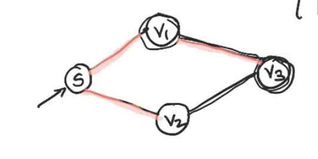
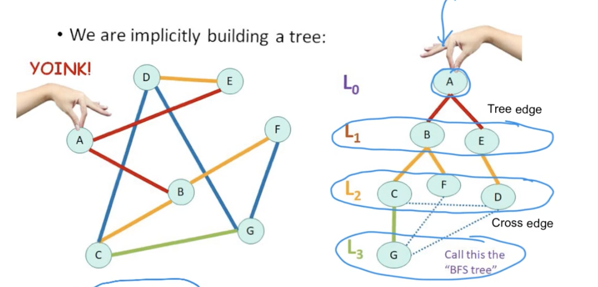

# A general way to traverse a graph

## General Graph Search

- With the way fringe edges work the algorthm gives us a search tree.
- The set of captured vertices == the set of reachable nodes from "S"

Search tree:
- P --> C (parent captured the child)

Two buckets:
- Captured and yet to be captured

## Graph Algorithms Template

This words for directed or undirected graphs
- Where things differe is the "Policy" of which fringe to pull on

Template of search:

``` c++
class Graph {
	func search(s: Int) {
		// captured and parent init to 0 & nil
		captured[s] = 1
		while fringe edge exists {
			// pick one => (u,v)

			captured[v] = 1
			parent[v] = u
		}
	}
}
```

## 6 types of graph algorithms

| Algorithm      | Policy | Search Tree     |
| :---        |    :----:   |          ---: |
| Breadth-first search (BFS)      | Choose the fringe edge that was seen first.       | BFS Tree  |
| Depth-first search (DFS)   | Choose the fringe edge that was seen last (most recent)        | DFS      |
| Dijkstra's   | Choose the fringe edge whose RHS vertex has the smallest numerical label (single label)       | Shortest path tree      |
| Prim's   | Choose the fringe edge whose RHS vertex has the smallest numerical label (single label)        | Minimum spanning tree (MST)     |
| Best-frist Search   | Choose the fringe edge whose RHS vertex has the smallest numerical label (single label)       | Best-first search tree      |
| A*   | Similar, except that vertices have two labels which need to be added        | A* tree     |

He says they all share the same pattern but the policy is different. So if we can learn the foundation, it's just swapping the correct policy as needed.

----

# BFS Requirements

- explroe the graph in increasing order of distance from "S"
- Steps:
	- 1st capture the immediate neighbors of "S" (one hop away)
	- then capture their neighbors (Two hops)
	- etc

Helpful for finding how many hops until reaching "S"
- for example, a disease spreading and what day will you get the disease from your neighbor?

# BFS Need for a Queue

- Using a queue to prioritize which vertex to capture first
- FIFO

# BFS Handling Cycles



- In the change that a graph has a cycle, we don't want to add the same vertex to a queue twice.

**Q:** A vertex should only be added to a queue once. How do we prevent double captures?
**A:** We keep an array of "visited" vertexs and check against that.
	- Vertexs are visited first then captured

# BFS Pseudocode and BFS tree

Modify the template pseudocode for BFS

``` c++
class Graph {
	func search(s: Int) {
		// captured and parent init to 0 & nil
		var captured[s] = 1 // source
		var visited[s] = 1 // discovered but not captured

		// use a queue 

		var q = [Int]() // vertexObj
		q.append(s) // source index

		while !q.isEmpty {
			// pick one => (u,v)
			guard let v = q.first else { return }
			captured[v] = 1

			for w in adjlist[v] {
				if visted[w] == 0 {
					visited[w] == 1
					parent[w] == v
					q.append(w)
				}
			}
		}
	}
}
```

### Example:

Breadth-First Search - Exploring the world with a bird's eye view



- Every cross edge has a cycle in a BFS tree

----

## DFS and the need for a LIFO Stack
