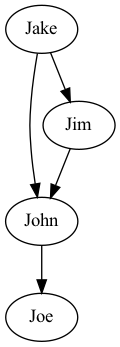

# Graphviz

Turns out there's a great way to easily visual graphs and create PDFs. I don't know if it'll need this but maybe one day I will, so documenting for future use if I ever need it.

Website: https://graphviz.org

# Install

```
brew install graphviz
```

# Tutorial

There's two types of graphs
1. graph
2. digraph

### Graph

File: `example1.dot`

```
graph {
	John -- Roman;
	Roman -- Steve;
	Steve -- Eric;
	Eric -- Roman;
	Eric -- John;
}

```

In termainl 
```
dot example1.dot -Tpdf > example1.pdf
```

Output:


### Digraph

File: `example2.dot`

```
digraph {
	John -> Roman;
	Roman <- Steve;
	Steve -> Eric;
	Eric -> Roman;
	Eric <- John;
}

```

In termainl 
```
dot example2.dot -Tpdf > example2.pdf
```

Output:
