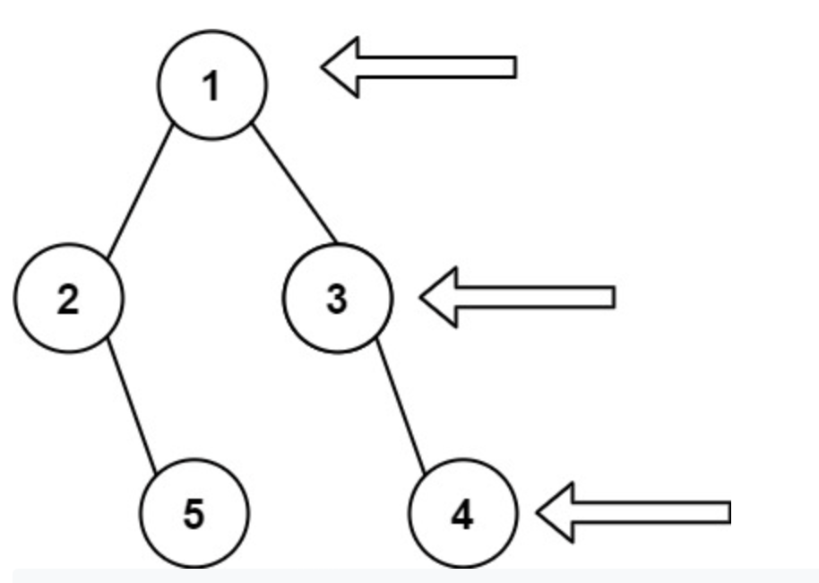

<!-- Live Trees Class with Ashish -->

Teacher:
- Tech lead at Google
- Ex microsoft / adobe
- Linkedin: https://www.linkedin.com/in/ashish-jindal-80751426/

-------

# Summary Of Preclass Video

Hash tables

### BST:
- Search O(logn)
- insert O(logn)
- Delete O(logn)
- Has order

#### Two borad ways of traversing trees:
- BFS (queue)
- DFS

#### DFS Traversals
- Preorder
- Inorder
- Postorder

#### BFS
- Queue-based iterative

#### How to reconstruct a binary tree
1. preorder + inorder
2. postorder + inorder

# Today's class schedule:

1. Tree Problems
	- Tree Traversals
		- BFS
		- DFS
			- Top down DFS
			- Bottom up DFS
			- Boundary Walk
			- Iterative stalk DFSf
	- Tree Construction
		- Top down
		- Left to right
		- Brute force
		- Divide and Conquer
2. DFS Problems
	- Path Sum
	- Path Sum II
3. Diameter of a Binary Tree
4. Count Univalue Subtree
5. Tree Constructions
	- convert Array to BST

# Tree Patterns

## 102. Binary Tree Level Order Traversal
Q: Given a binary tree, return the level order traversal of its nodes values(from left to right level by level)

Example:
```
Output:
[
	[1],
	[2,3],
	[4,5,6,7]
]
```


```
class TreeNode {
	var left: TreeNode?
	var right: TreeNode?
	var value: Int = 0
}
```

Printing a tree BFS version:

``` Swift
func bfs(root: TreeNode?) -> [Int] {
    guard let root = root else { return [] }
    
    var queue = [TreeNode]()
    queue.append(root)
    var result = [Int]()
    
    // loop
    while queue != nil {
        guard let node = queue.popLast() else { continue }
        result.append(node.value)
        
        // process node val && result append
        if let left = node.left {
            queue.append(left)
        }
        
        if let right = node.right {
            queue.append(right)
        }
    }
    return result
}
```

but the above doesn't print it level by level as a list array, see:

------

## 429. N-ary Tree Level Order Traversal

Given an n-ary tree, return the level order traversal of its nodes' values.

Nary-Tree input serialization is represented in their level order traversal, each group of children is separated by the null value (See examples).

Example 1:
```
Input: root = [1,null,3,2,4,null,5,6]
Output: [[1],[3,2,4],[5,6]]
```

Example 2:
```
Input: root = [1,null,2,3,4,5,null,null,6,7,null,8,null,9,10,null,null,11,null,12,null,13,null,null,14]
Output: [[1],[2,3,4,5],[6,7,8,9,10],[11,12,13],[14]]
```

Constraints:
- The height of the n-ary tree is less than or equal to 1000
- The total number of nodes is between [0, 104]

This is the same question as the previous but instead we cycle through the array of children instead of left and right.


## 107. Binary Tree Level Order Traversal II

Given the root of a binary tree, return the bottom-up level order traversal of its nodes' values. (i.e., from left to right, level by level from leaf to root).

Example 1:
```
Input: root = [3,9,20,null,null,15,7]
Output: [[15,7],[9,20],[3]]
```

This is the same as 102 but we can just reverse the array


## 199. Binary Tree Right Side View

Given the root of a binary tree, imagine yourself standing on the right side of it, return the values of the nodes you can see ordered from top to bottom.



Example 1:
```
Input: root = [1,2,3,null,5,null,4]
Output: [1,3,4]
```

The number of nodes in the tree is in the range [0, 100].
-100 <= Node.val <= 100

The catch here is if the left height is longer than the right height, then we also need to take that into account.

Interview tip:
- At least considering 2 or 3 examples because the test case will always be basic.
- See if you can find pitfalls

Solution:
- The same as the previous 3 using BFS and then use the last element from each array.

How to have intuitively know to do it this way?
- There are only two types of traversal methods
	1. DFS
	2. BFS
- So from there we need to decide which one makes sense.


## 103. Binary Tree Zigzag Level Order Traversal

Given the root of a binary tree, return the zigzag level order traversal of its nodes' values. (i.e., from left to right, then right to left for the next level and alternate between).


Example:
```
Input: root = [3,9,20,null,null,15,7]
Output: [[3],[20,9],[15,7]]
```

Constraints:

The number of nodes in the tree is in the range [0, 2000].
-100 <= Node.val <= 100

My idea of how to solve it:
- I think we can just do the same BFS but mod the level determine which variation of the zigzag we are on
- Another student suggested a boolean that toggles each append to result
- Maybe it just makes sense to reversed() 

Solution:
- The teacher uses a reversed 

```
func zigzag(root: TreeNode) {
	guard let root = root else { return [] }

	var ltor = true // left to right
	while q.count > 0 {
		numNodes = q.count
		temp = []
		while node > 0 {
			node = q.first
			temp.append(node.val)
			if let left = node.left {
				q.append(node.left)
			}

			if let right = node.right {
				q.append(node.right)
			}
		}
		if !ltor {
			temp.reverse()
		}
		ltor = !ltor

		result.append(temp)
	}
	return result
}
```
# Tree DFS Template

Template:

```
def dfs(node):
	if node.left is not None:
		dfs(node.left)
	if node.right is not None:
		dfs(node.right)
```

Template with basecase:

```
def dfs(node):
	if node.left is None and node.right is None:
		# Base case answer generated here

	# recursive case: Internal node
	if node.left is not None:
		dfs(node.left)
	if node.right is not None:
		dfs(node.right)
```


## 112. Path Sum

Given the root of a binary tree and an integer targetSum, return true if the tree has a root-to-leaf path such that adding up all the values along the path equals targetSum.

A leaf is a node with no children.

Example 1:
```
nput: root = [5,4,8,11,null,13,4,7,2,null,null,null,1], targetSum = 22
Output: true
Explanation: The root-to-leaf path with the target sum is shown.
```

Explaination
- This is top down DFS

```
func dfs(node: TreeNode?, target: Int) {

}