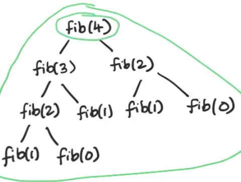
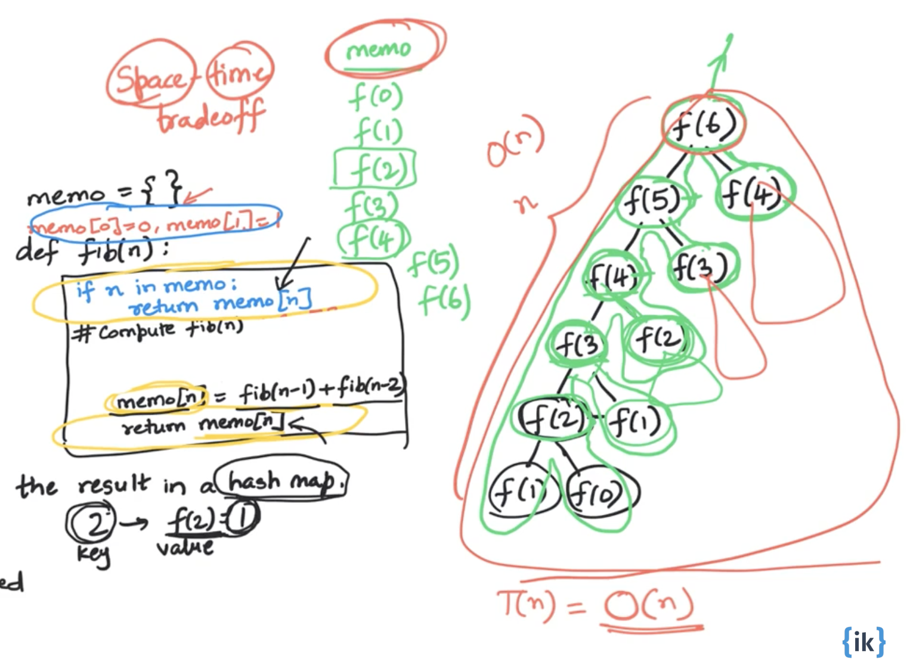
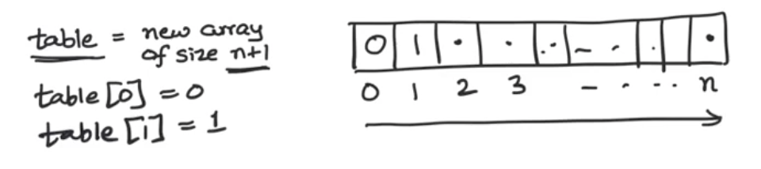

# Dynamic Programming Foundation

## Dynamic Programming Introduction

<details>
  <summary>View Notes</summary>

**Definition:** DP is recursion without repetition

**Fib Example:**

*Original:*

``` swift
func fib(n: Int) -> Int {
	if n == 0 || n == 1 {
		return n
	}

	return fib(n-1)+fib(n-2)
}
```



- We can notice that in this tree there is repeating fib(3), feb(2), etc
- Many sub-problems appear multiple times

**Goal:** Avoid repeated work; each subproblem must be evaluated only once

**Expectations:** The naive recursive implementation took exponential time
	- because of the repeated work. 
	- Avoiding the repeating work should make execution much faster
	- Current state: expontial time

### Introduciton Quiz:
> The Tribonacci sequence Tn is defined as follows:
> T0 = 0, T1 = 1, T2 = 1
> Tn = Tn-1 + Tn-2 + Tn-3
> Consider the following recursive code which implements the mathematical definition:
>
> What is the running time complexity of this implementation?

**A:** Some exponential in n

</details>


## Top-down Memoization

<details>
  <summary>View Notes</summary>


*Original:*

``` swift
func fib(n: Int) -> Int {
	if n == 0 || n == 1 {
		return n
	}

	return fib(n-1)+fib(n-2)
}
```

- The original code was done ina depth first search
- Traversal can be done in in-order, pre-order and post-order
 
What if we stored the result in a hash map:

| key | f(n) = v |
|-----|----------|
| 2   | f(2) = 1 |

- This is called memorandum or memo; something to be remembered but in CS it's called Memoization

``` swift
var memo = [Int: Int]() // hashmap

func fib(_ n: Int) -> Int {
	// it's stored so use it
	if let value = memo[n] {
		return value
	}

	// compute fib(n)
	if n == 0 || n == 1 {
		return n // these are leaf nodes, so no need to store these
	}

	memo[n] = fib(n-1)+fib(n-2)
	return memo[n]!
}
```

**Steps from above code:**
1. we check if it's stored
2. Compute `fib(n)` & store it

**Alternative**

``` swift
var memo = [Int: Int]() // hashmap
memo[0] = 0
memo[1] = 1

func fib(_ n: Int) -> Int {
	// it's stored so use it
	if let value = memo[n] {
		return value
	}

	memo[n] = fib(n-1)+fib(n-2)
	return memo[n]!
}
```

- Still a top-down following DFS 

**Time Complexity:** `O(n) func`

**Space Complexity:** `O(n)` because of memo
	- space trade off for better T(n)



---

### Top-down Memoization Quiz:

> **Q-1:** What is the running time complexity of this code for calculating the nth Tribonacci number, in terms of n?

**A:** Linear

> **Q-2:** Dynamic programming has the potential to transform exponential-time algorithms to polynomial time.

**A:** True - This was shown via the example of calculating fib(n) or tribonacci(n). 


I got Q-2 wrong, so here's an examply of all the `T(n)`
- Polynomial time is `n^k`
- Exponential time is `2^n`

> **Q-2:** Memoization can only be done by using a hash table data structure, not a simple array. 

**A:** False - As long as it's accessable via constant time, it won't be an issue

### End of section summary:

1. Using memoization we can drastically cut down run time
2. In the case of Fib originally being exponential we were able to cut it down to linear
3. Memoization can be Hash table or array, constant time access is key
4. This was a top-down memoization meaning we check memo at the start of DFS
	- but add it to memo when returning the value back up

Simplest example:

``` swift
var memo = [Int: Int]()

func dfs(_ n: Int) -> Int {
	if let val = memo[n] { return val }

	// some case when n isn't set

	memo[n] = dfs(n)
	return memo[n]!
} // this is an inf loop but just the idea
```

</details>


## Bottom up Tabulation

<details>
  <summary>View Notes</summary>

- A bottom up soltion - prefered by most interviewers
	- and will be what is used most of the time at IK
- Tabulatoin - bottom-up

*Original:*

``` swift
func fib(n: Int) -> Int {
	if n == 0 || n == 1 {
		return n
	}

	return fib(n-1)+fib(n-2)
}
```

^ exponental

*Dependency graphs - Bottom up:*

- "collapse" them into unique nodes
	- No longer using recursion trees but instead using dependency graphs
- A directed graph and Acyclic
- `Acyclic` - because each node only depends on smaller problems
	- it'll never have a cycle
- Making this a `DAG` -> `Dependency Acyclic Graph`


**Topological Sort:** When we have a `DAG` we can sort the vertices of the graph so that the edges are going in a single direct (left to right).

**Steps:**
1. Calculate the values of `Fib()` in `Top sort order`
2. Then cache them
3. Then return table[n]



- Now we can calculate this iteratively, bottom up

``` js
func fib(_ n: Int) -> Int {
    if n == 0 || n == 1 { return n } // base case
    
    // Initialize cache
    var table = [Int?](repeating: nil, count: n+1)
    table[0] = 0 // constants
    table[1] = 1 // constants
    
    for i in 2...n { // loop
        guard let a = table[i-1], let b = table[i-2] else { continue }
        table[i] = a + b
    }
    return table[n]!
}
```

**Time Complexity:** `O(n)` the for loop

**Space Complexity:** `O(n)` cause O(n) space to cache results

---
**Thoughts**

It feels the Top sort variation is really complicated since swift requires optional checks in order to assign a `table[i]`.

I ran a speed test agains both Top sort and memoization and memoization comes on top as well: [Speed test](<./memoize\ vs\ top\ sort\ fib.swift>)

Regardless, from my bits of research, it seems the reason top sort or bottom up versions are better is because it is more stable. The problem with memoization is it requires stack space and is prone to stack overflow since we are using DFS.

|	| Pros| Cons |
|----|--------------------|-----|
|Memoization / Top down / (DFS) | Simple to write. | requires stack space. prone to stackoverflow.|
|Top sort / bottom up | allocate exact memory usage | complicated to write in swift |

---

**Additional efficiency**

- What if we were able to limit the caching size? 
	- We know since it's top up we can limit the amount of memory required after passing data forward

1. Initially we have:
`[fib(0)][fib(1)][fib(2)]`

2. For `fib(3)` we only need `[fib(1)]` & `[fib(2)]`

fib(3) can be stored at index 0:
`[fib(3)][fib(1)][fib(2)]`

3. for `fib(4)` we need `[fib(3)]` & `[fib(2)]`

fib(4) can be stored at index 1:

`[fib(3)][fib(4)][fib(2)]`

4. then for `fib(5)` we need `[fib(3)]` & `[fib(4)]` and we can store it at i = 2

`[fib(3)][fib(4)][fib(5)]`

5. etc

The pattern is as such:
1. Index-0: multiples of 3 or `i % 3 = 0`
2. Index-1: if `i % 3 = 1`
3. Index-2: if `i % 3 = 2`

``` js
func fib(_ n: Int) -> Int {
    if n == 0 || n == 1 { return n } // base case
    
    // Initialize cache
    var table = [Int?](repeating: nil, count: 3) // only 3
    table[0] = 0 // constants
    table[1] = 1 // constants
    
    for i in 2...n { // loop
        guard let a = table[(i-1)%3], let b = table[(i-2)%3] else { continue }
        table[i%3] = a + b
    }
    return table[n%3]!
}
```

**Time Complexity:** `O(n)` the for loop

**Space Complexity:** `O(1)` cause table size is 3 or constant, 1

### Bottom-up Tabulation Quiz 

> **Q-1:** The nth Tribonacci number can be calculated in O(n) time and using no more than O(n) space. 

**A:** True

> **Q-2:** The nth Tribonacci number can be calculated in O(n) time and using only O(1) space. 

**A:** True

> **Q-3:** Bottom-up tabulation works by

**A:** Transforming recursive calls to a loop. Instead of a recursive implementation of f(n), we have a for loop. 


### End of section summary:

1. Top Sort / Bottom up is faster when limiting cache size (it seems)
2. Bottom up is safer because recursion is prone to stack space stackoverflows
3. With limiting cache size we can have constant space complexity

</details>


## Climbing n stairs

<details>
  <summary>View Notes</summary>

</details>
