# Dynamic Programming Foundation

These course notes are broken up into two sections:

1. [Counting problems](#counting-problems)
2. [Optimization problems](#optimization-problems)

# Counting Problems

## Dynamic Programming Introduction

<details>
  <summary>View Notes</summary>

**Definition:** DP is recursion without repetition

**Fib Example:**

*Original:*

``` swift
func fib(n: Int) -> Int {
	if n == 0 || n == 1 {
		return n
	}

	return fib(n-1)+fib(n-2)
}
```


- We can notice that in this tree there is repeating fib(1), feb(2), etc
- Many sub-problems appear multiple times

**Goal:** Avoid repeated work; each unique subproblem must be evaluated only once

**Expectations:** The naive recursive implementation took exponential time

- because of the repeated work. 
- Avoiding the repeating work should make execution much faster
- Current state: expontial time

### Introduciton Quiz:
> The Tribonacci sequence Tn is defined as follows:
> T0 = 0, T1 = 1, T2 = 1
> Tn = Tn-1 + Tn-2 + Tn-3
> Consider the following recursive code which implements the mathematical definition:
>
> What is the running time complexity of this implementation?

**A:** Some exponential in n

</details>


## Top-down Memoization

<details>
  <summary>View Notes</summary>


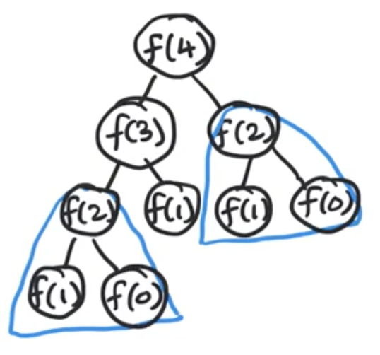


*Original:*

``` swift
func fib(n: Int) -> Int {
	if n == 0 || n == 1 {
		return n
	}

	return fib(n-1)+fib(n-2)
}
```

- The original code was done ina depth first search
- Traversal can be done in in-order, pre-order and post-order
 
What if we stored the result in a hash map:

| key | f(n) = v |
|-----|----------|
| 2   | f(2) = 1 |

- This is called memorandum or memo; something to be remembered but in CS it's called Memoization

``` swift
var memo = [Int: Int]() // hashmap

func fib(_ n: Int) -> Int {
	// it's stored so use it
	if let value = memo[n] {
		return value
	}

	// compute fib(n)
	if n == 0 || n == 1 {
		return n // these are leaf nodes, so no need to store these
	}

	memo[n] = fib(n-1)+fib(n-2)
	return memo[n]!
}
```

**Steps from above code:**
1. we check if it's stored
2. Compute `fib(n)` & store it

**Alternative**

``` swift
var memo = [Int: Int]() // hashmap
memo[0] = 0
memo[1] = 1

func fib(_ n: Int) -> Int {
	// it's stored so use it
	if let value = memo[n] {
		return value
	}

	memo[n] = fib(n-1)+fib(n-2)
	return memo[n]!
}
```

- Still a top-down following DFS 

**Time Complexity:** `O(n) func`

**Space Complexity:** `O(n)` because of memo
	- space trade off for better T(n)


---

### Top-down Memoization Quiz:

> **Q-1:** What is the running time complexity of this code for calculating the nth Tribonacci number, in terms of n?

**A:** Linear

> **Q-2:** Dynamic programming has the potential to transform exponential-time algorithms to polynomial time.

**A:** True - This was shown via the example of calculating fib(n) or tribonacci(n). 

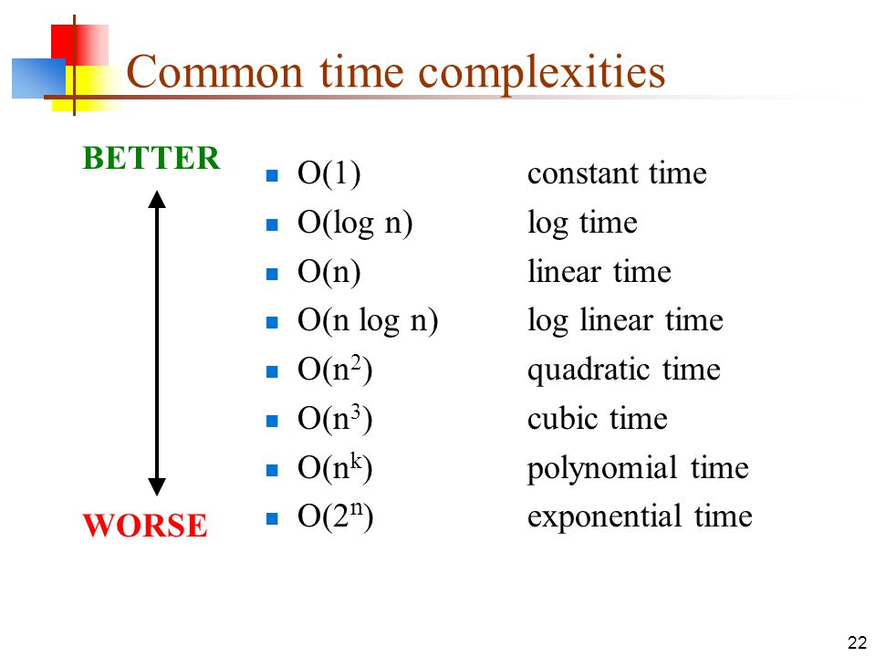

I got Q-2 wrong, so here's an examply of all the `T(n)`
- Polynomial time is `n^k`
- Exponential time is `2^n`

> **Q-2:** Memoization can only be done by using a hash table data structure, not a simple array. 

**A:** False - As long as it's accessable via constant time, it won't be an issue

### End of section summary:

1. Using memoization we can drastically cut down run time
2. In the case of Fib originally being exponential we were able to cut it down to linear
3. Memoization can be Hash table or array, constant time access is key
4. This was a top-down memoization meaning we check memo at the start of DFS
	- but add it to memo when returning the value back up

Simplest example:

``` swift
var memo = [Int: Int]()

func dfs(_ n: Int) -> Int {
	if let val = memo[n] { return val }

	// some case when n isn't set

	memo[n] = dfs(n)
	return memo[n]!
} // this is an inf loop but just the idea
```

</details>


## Bottom up Tabulation

<details>
  <summary>View Notes</summary>

- A bottom up soltion - prefered by most interviewers
	- and will be what is used most of the time at IK
- Tabulatoin - bottom-up

*Original:*

``` swift
func fib(n: Int) -> Int {
	if n == 0 || n == 1 {
		return n
	}

	return fib(n-1)+fib(n-2)
}
```

^ exponental

*Dependency graphs - Bottom up:*

- "collapse" them into unique nodes
	- No longer using recursion trees but instead using dependency graphs
- A directed graph and Acyclic
- `Acyclic` - because each node only depends on smaller problems
	- it'll never have a cycle
- Making this a `DAG` -> `Dependency Acyclic Graph`

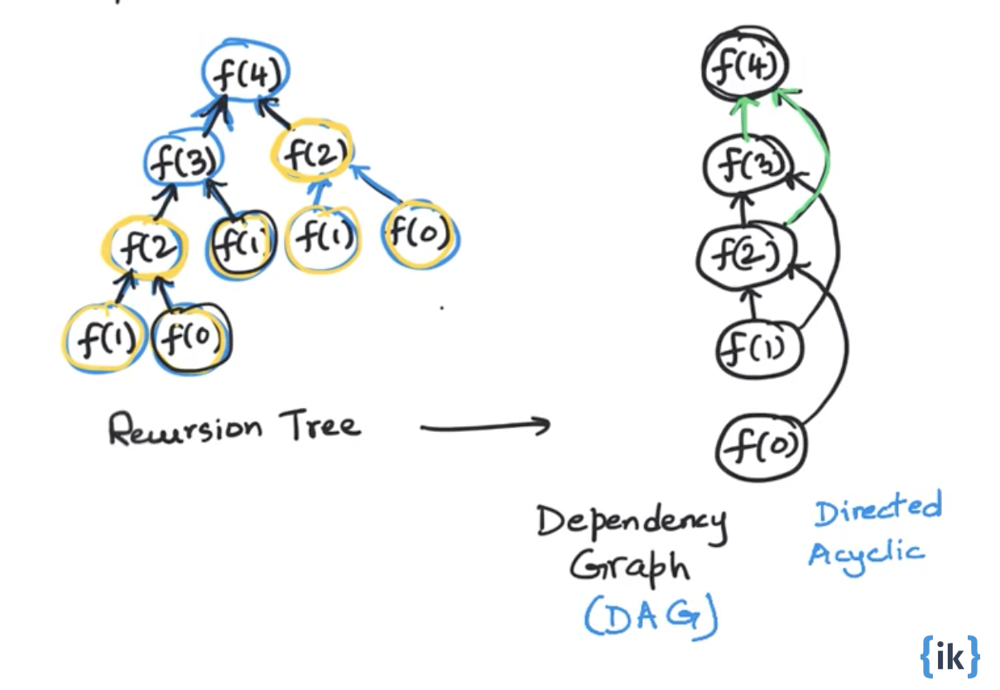

**Topological Sort:** When we have a `DAG` we can sort the vertices of the graph so that the edges are going in a single direct (left to right).

**Steps:**
1. Calculate the values of `Fib()` in `Top sort order`
2. Then cache them
3. Then return table[n]


- Now we can calculate this iteratively, bottom up

``` swift
func fib(_ n: Int) -> Int {
    if n == 0 || n == 1 { return n } // base case
    
    // Initialize cache
    var table = [Int?](repeating: nil, count: n+1)
    table[0] = 0 // constants
    table[1] = 1 // constants
    
    for i in 2...n { // loop
        guard let a = table[i-1], let b = table[i-2] else { continue }
        table[i] = a + b
    }
    return table[n]!
}
```

**Time Complexity:** `O(n)` the for loop

**Space Complexity:** `O(n)` cause O(n) space to cache results

---
**Thoughts**

It feels the Top sort variation is really complicated since swift requires optional checks in order to assign a `table[i]`.

I ran a speed test agains both Top sort and memoization and memoization comes on top as well: [Speed test](<./memoize\ vs\ top\ sort\ fib.swift>)

Regardless, from my bits of research, it seems the reason top sort or bottom up versions are better is because it is more stable. The problem with memoization is it requires stack space and is prone to stack overflow since we are using DFS.

|	| Pros| Cons |
|----|--------------------|-----|
|Memoization / Top down / (DFS) | Simple to write. | requires stack space. prone to stackoverflow.|
|Top sort / bottom up | allocate exact memory usage | complicated to write in swift |

---

**Additional efficiency**

- What if we were able to limit the caching size? 
	- We know since it's top up we can limit the amount of memory required after passing data forward

1. Initially we have:
`[fib(0)][fib(1)][fib(2)]`

2. For `fib(3)` we only need `[fib(1)]` & `[fib(2)]`

fib(3) can be stored at index 0:
`[fib(3)][fib(1)][fib(2)]`

3. for `fib(4)` we need `[fib(3)]` & `[fib(2)]`

fib(4) can be stored at index 1:

`[fib(3)][fib(4)][fib(2)]`

4. then for `fib(5)` we need `[fib(3)]` & `[fib(4)]` and we can store it at i = 2

`[fib(3)][fib(4)][fib(5)]`

5. etc

The pattern is as such:
1. Index-0: multiples of 3 or `i % 3 = 0`
2. Index-1: if `i % 3 = 1`
3. Index-2: if `i % 3 = 2`

``` swift
func fib(_ n: Int) -> Int {
    if n == 0 || n == 1 { return n } // base case
    
    // Initialize cache
    var table = [Int?](repeating: nil, count: 3) // only 3
    table[0] = 0 // constants
    table[1] = 1 // constants
    
    for i in 2...n { // loop
        guard let a = table[(i-1)%3], let b = table[(i-2)%3] else { continue }
        table[i%3] = a + b
    }
    return table[n%3]!
}
```

**Time Complexity:** `O(n)` the for loop

**Space Complexity:** `O(1)` cause table size is 3 or constant, 1

### Bottom-up Tabulation Quiz 

> **Q-1:** The nth Tribonacci number can be calculated in O(n) time and using no more than O(n) space. 

**A:** True

> **Q-2:** The nth Tribonacci number can be calculated in O(n) time and using only O(1) space. 

**A:** True

> **Q-3:** Bottom-up tabulation works by

**A:** Transforming recursive calls to a loop. Instead of a recursive implementation of f(n), we have a for loop. 


### End of section summary:

1. Top Sort / Bottom up is faster when limiting cache size (it seems)
2. Bottom up is safer because recursion is prone to stack space stackoverflows
3. With limiting cache size we can have constant space complexity

</details>


## Climbing `n` stairs

<details>
  <summary>View Notes</summary>

By using decrease and conquer we can break the problem into smaller parts.

1. 1 steps have 1 variation
2. 2 steps have 2 variations
3. 3 steps have 3 variations


From those three whiteboard drawings we can see a pattern and apply that into forming a theory; Can these three be enough to solve any `n` step problems? Why?
- I believe 4 is going to look like three but with one additional 1 step to 4 step jump. There's a visual pattern I can see. It wouldn't look exactly like two `2s` because there would be a jump between 1st step and third step. 

Turns out this is the exact same math as the fibonacci sequence.

- 1 step or 2 steps no other ability to step. 
	- which I think I understand it as `n-1 -> n` & `n-2 -> n` 
	- Why n-1 or n-2?
		- is it because the last move is 1 for 1+1+1+1
		- and the last move for 2 is 2+2+2+2

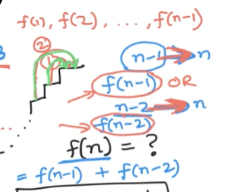
The math ^

So the function is nearly the same. The difference being we don't start at zero and we set `1` & `2` as a base case instead of `0` & `1`

``` swift
func stairCounter(_ n: Int) -> Int {
    if n == 1 || n == 2 { return n }
    
    var table: [Int?] = Array(repeating: nil, count: n+1) // plus 1 because starts at 0 and we need 5 open spots
    table[1] = 1
    table[2] = 2
    
    for i in 3...n { // starting at 3 since 1 and 2 are base cases
        guard 
            let a = table[(i-1)%3], let b = table[(i-2)%3] // same as fib
        else { continue }
        table[i%3] = a + b
    }
    
    return table[n%3]!
}
```

**Time Complexity:** `O(n)` the for loop

**Space Complexity:** `O(1)` cause table size is 3 or constant, 1

### Climbing `n` stairs Quiz 

> **Q-1:** TYou are climbing a staircase. It takes n steps to reach to the top (n > 3). Each time you can either climb 1 or 2 steps. In how many distinct ways can you climb to the top? Pick the appropriate recurrence equation:

**A:**

f(n) = f(n-1) + f(n-2), f(0) = 1, f(1) = 1

f(n) = f(n-1) + f(n-2), f(1) = 1, f(2) = 2

> **Q-2:** You are climbing a staircase. It takes n steps to reach to the top (n > 3). Each time you can either climb 1, 2 or 3 steps. In how many distinct ways can you climb to the top? Pick the appropriate recurrence equation with base cases:

**A:** f(n) = f(n-1) + f(n-2) + f(n-3), f(0) = 1, f(1) = 1, f(2) = 2
f(3) should be 4. This means f(0) + f(1) + f(2) = 4. So #4 is the right equation. 

> **Q-3:** How many distinct permutations of the numbers 1 and 2 (in which repetition is allowed) add up to n? Assume that n > 2. For example, if n = 4, the permutations are 2-2, 1-1-2, 1-2-1, 2-1-1, 1-1-1-1. 
> Suppose f(n) = The number of such permutations. 
> Pick the recurrence equation for f(n):

**A:** f(n) = f(n-1) + f(n-2)

**Solution:** 
If we visualize each permutation as a sequence of blanks, the last blank for any of those permutations can be either filled with a 1 or 2. Fo if f(n) is the number of permutations of 1s and 2s adding up to n, it can be split as the number of permutations adding up to n-1 followed by a 1 at the end + the number of permutations adding up to n-2 followed by a 2 at the end. So f(n) = f(n-1) + f(n-2)

This makes total sense because if you add up all the last permutations ending in 2 == n-2 == 2 and all the perms ending in 1 == n-1 = 3

`if n = 4, the permutations are 2-2, 1-1-2, 1-2-1, 2-1-1, 1-1-1-1`

So if we think about the steps problem again, we looked at the final stage of steps, "the ending". The ending ended with either 1 step or 2 steps. If there was a 3rd step, it would be n-3.

### End of section summary:

1. we took a counting problem
2. with decrease and conquer we found a recurrence equation
3. with DP, we implimented a recursive / iterative implementation w/o repetition
	- which turned out to be the same as fib

### Personal thoughts:

~~I kind of get how we got i-1 & i-2 for the steps but I doubt I understand it enough to figure it out on another problem.~~

See what I wrote in `Q-3` but summary: We can look at the final literal step of what is possible. So in the 2 stairs problem, we knew that final move up the staircase would either be 1 step or 2 steps. So n-1 and n-2 respectively. If the child could jump 3 steps, the ending would also have 3 or n-3.

</details>


## Counting subsets of size k

<details>
  <summary>View Notes</summary>


Using pascals triangle we can determine the k elements out of a set of n elements.

For example, we have a class room of n students and we want groups of k students. Within each group, order doesn't matter and a student can only belong in a single group.

By using the lazy manager strat, we only make a decision about the 1st student.

This type of counting subsets of size k is visually seen as `c(n,k)` or `n choose k`

`c(n,k) = c(n-1) + c(n-1, n-k)`

**Refresher on pascals triangle**

- To get any value in the triangle, you add the previous two above it.

In the above diagram, `c(4, 2) = c(3, 1) + c(3, 1)` or `6 = 3 + 3`


Original recursive example:

``` swift
func c(_ n: Int, _ k: Int) -> Int {
	// base case
	if k == 0 || k == n { return 1 }

	// recursive case
	return c(n-1, k) + c(n-1, k-1)
}
```

**Time Complexity:** `O(2^n)` 
(n, 0) + (n, 1) + (n, 2) ... (n, n) = 2^n

---

We can see in the diagram that:

- the outside edge has `1` going all the way down both sides.
- the repition of `3` & `4` are visible
- there is probably a battern with middle even numbers `2` and `6`, lets try it

```
        1
       1 1
      1 2 1
     1 3 3 1
    1 4 6 4 1
  1 5 10 10 5 1
1 6 50 100 50 6 1
```

There might even be a pattern in counting:

- cause we can see a 1's on the left and right edge
- then the second diagonal from left to right || right to left shows: `1, 2, 3, 4, 5 6`
- but the line after seems to have a weird pattern `1,3,6,10,50`
- regardless, there is this triangle pattern with each inner pattern that should be taken care of in DP

### End of section summary:

- Seeing the pattern is important but also identifying the time complexity inorder to explain the benefit of DP.

</details>


## Counting subsets of size k using DP

<details>
  <summary>View Notes</summary>


Still looking at pascals triangle:

```
         1
        1 1
       1 2 1
      1 3 3 1
     1 4 6 4 1
   1 5 10 10 5 1
 1 6 50 100 50 6 1
```


Previously in the recursion class we were able to get the c(n,k) func down to `O(n)` by using factorial

```
c(n,k) = n! / k!(n-k)!
```

- The problem with this is large numbers will cause stackoverflows

With DP we can get this down to `O(nk)`

`c(n,k) = c(n-1, k) + c(n-1, k-1)`

How many subproblems in the above formula?

- the first parameter is n which can vary:
	- n, n-1 .... 0
	- which mean n+1 choices
- the second parameter is k which can vary:
	- k, k-1 .... 0
	- which mean k+1 choices
- so: `(n+1)*(k+1)` which is polynomial

**Q:** Why is it n+1 and k+1 choices? where does the +1 come from?
**A:** The +1 is for the 0 because in subsets, the empty set is also considered a subset

**Prithu's comment:**

- +1 is for the 0. So (1,2,3...n) which is 'n' choices plus the 0
- If you see the pascals triangle in the previous video, it shows the choices for n and k
- When finding subsets, an empty set is also considered a subset.


If we compute each subproblem once, we should improve the time complexity with less repition.

---

In this problem we create a dependency graph:


Ultimately, we want to solve the red circled `c(n,k)`.

**Q:** Where is c(n-1, k)? Where is c(n-1, k-1)?

- in the graph it's obvious to see

**Q:** What does this look like in the graph?

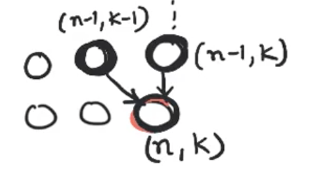

This is the entry point in repeating patterns for our bottom up approach

- This will become form of topological sort

---

We know `c(n, 0) = 1` & `(n,n) = 1` where `k = n`

- the fact that `(n,n)` means there'll be a diagonal that goes all the way down to `(k,k)``
	- but this doesn't mean `(n,k)` is where `(n,k)` ends
	- anything above the diagonal are not useful, as seen in red below

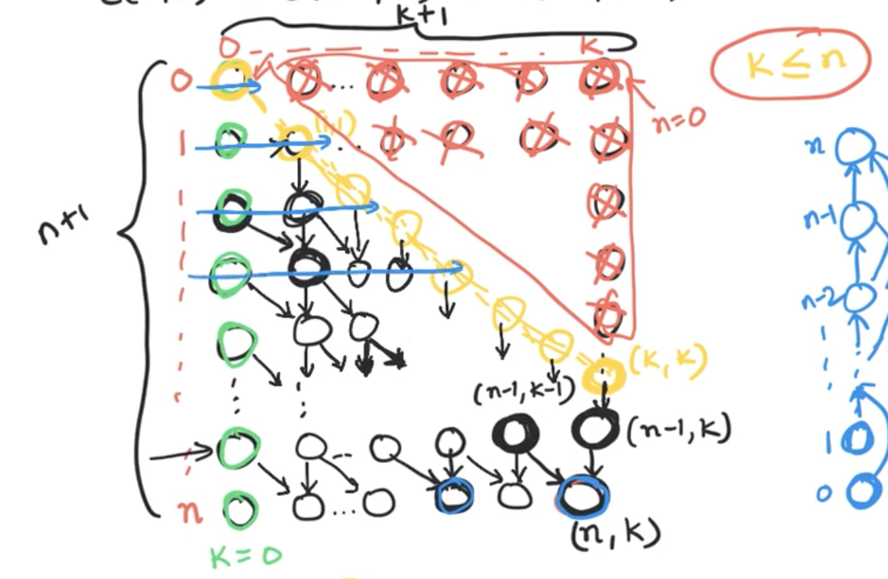

Topological sort order would be left to right as seen in blue
- at the very end we'd reach `(n,k)` and have our solution.

``` swift
func c(n,k) {
	// base case
	if k == 0 || k == n {
		return 1 // as we saw above
	}

	// a 2D array of size (n+1)*(k*1)
	var table: [[Int?]] = Array(repeating: Array(repeating: nil, count: (k*1)), count: (n+1))

	for row in 0...n {
		table[row][0] = 1 // column 0 is all 1
	}

	for col in 0 to k {
		table[col][col] = 1 // the diagonal where (n,n)
	}

	for row in 2...n { // starting at 2 because 1 & 2 are already populated
		for col in 1...min(row, k) { // why? see below

			table[row][column] = // c(n,k) = c(n-1, k) + c(n-1, k-1)
				table[row-1][col] + // from the original formula
				table[row-1][col-1] // form the original formula

		}
	}
	return table[n][k] // solution will exist now
}
```

**Q:** I'm hazy on the `for col in 1...min(row, k)`, why?

- What is the right most column? 
	- for layer 0 it's column 0 
	- for layer 1 it's column 1
	- for layer 2 it's column 2
	- as seen in the dia below (green to yellow circle):


- Why not just be row number? well if the row number passes k (it's getting closer and closer to `n`) once the number exceeds `k` it should be capped at k
	- Still don't understand
		- if n = 5 & k = 4
			- layers go from: 		0, 1, 2, 3, 4, 5 (n+1) row
			- columns (k) go from:	0, 1, 2, 3, 4, 5 (k+1) column
		- So in this example k=4, but we get a 5th column, so min it at constant k=4 cause we don't care about larger than k


---

**Time Complexity:** `O(nk)` because of the for loop

**Space Complexity:** `O(nk)` because of the table matrix

---

**Q:** Is there space here that we can reuse to use less space?

- yes, previous lay becomes useless after a row has been iterated. So we can reuse the space in layers
	- a layer only depends on the previous layer
		- layers i and i+1
	- this optimized version would come down to:
		- **Space Complexity:** `O(k)` because each layer uses O(k) space where k is the column or row length

### End of section summary:

- The n+1 and k+1 are +1 because the empty set is also considered a subset
- It seems DP allows working with large data safer from stackoverflow.
	- meaning the benefit I'm seeing is in regards to large data
- two variables multipled by each other in time complexity is polynomial
	- O(n*m) is polynomial
- This uses a topological sorting, but why?
	- because it's linear ordering with directed acyclic graph.
	- (n-1,k-1) -> (n,k) & (n-1, k) -> (n,k)


- I think I understand why we capped at `k` with the min(row,k) but I need to be aware of it when practicing problems. How do I know when to do this? in subsets size of k, we only can count against k it seems.

### Counting subsets of size k using DP Quiz

> **Q-1:** The number of entries in row n of Pascal’s triangle is (assuming n = 0 for the apex at the top):

**A:** n+1; Row 0 has 1 entry. Row 1 has 2 entries. Row 2 has 3 entries and so on. 

> **Q-2:** The sum of all the entries in row n of Pascal’s triangle is:

**A:** 2^n; C(n,0) + C(n,1) + … + C(n,n) = Number of subsets of any size that can be formed out of the n elements = 2^n

```
        1 	<- 2^0 = 1 = 1
       1 1 	<- 2^1 = 1+1 = 2
      1 2 1 	<- 2^2 = 1+2+1 = 4
     1 3 3 1 	<- 2^3 = 1+3+3+1 = 8
    1 4 6 4 1
  1 5 10 10 5 1
1 6 50 100 50 6 1
```


> **Q-3:** In the implementation of C(n,k) discussed in the video, if k < n, then the valid entries in table are identical to rows 0 to n in Pascal’s triangle. 

**A:** False; The entries in rows k+1… n would be an incomplete prefix of the entries in the corresponding row of Pascal’s triangle. 

- because it would be a partial triangle

> **Q-4:** In the implementation of C(n,k) discussed in the video, if k = n, then the valid entries in table are identical to rows 0 to n in Pascal’s triangle.

**A:** True; it'll be a full triangle. 

> **Q-5:** Pascal’s triangle can be constructed upto row n in time (pick the tightest asymptotic bound):

**A:** O(2^n); Use the same DP method used to compute C(n,k). Constructing row i will take O(i) time. Summing this for all i in 1 to n, we get T(n) = O(n^2)

> **Q-6:** The value of C(n,k) is (assume k << n)

**A:** O(n^k); Note that the question is not asking about the time to calculate C(n,k). It is asking what is the asymptotic complexity of the VALUE of C(n,k), assuming that k is a small constant. C(n,1) is O(n). C(n,2) = n(n-1)/2 = O(n^2) and so on. 

</details>


## Counting unique paths in a grid

<details>
  <summary>View Notes</summary>

### Quick recap

|Example| type | w/ DP | Arry type |
|-------|------|----|-----------|
|fib(n) | recurrence question with one parameter | efficient implimentation with no repeated work | 1D array |
| fib(n) counting problem w/ decrease and conquer | recurrence question with one parameter | efficient implimentation with no repeated work | 1D array |
| c(n,k) | recurrence question with two parameter | efficient implimentation with no repeated work | 2D array |
| counting problem w/ decrease and conquer| recurrence question with two parameter | efficient implimentation with no repeated work | 2D array |

### The problem:

Given a 2D grid with m rows and n columns, count the number of unique paths starting at the top-left corner and getting to the bottom-right corner. All move must either go right or down.

```
		n = 3
	________________
	|__s_|____|____|
m=2	|____|____|__e_|

// where s is start & e is end
```

Three different paths the robot can take to from from s to e. as seen in red


- move right: 0 -> n-1
- move down: 0 -> m-1

A unique path will include `(m-1)+(n-1)` or `m+n-2`

> This is very similar to the problem with forming a committee or class group problems. because each committee we form, the "path" of selected students.

`c(m+n-2, n-1) = c(m+n-2, m-1) where m-1 = m+n-2-(n-1)`

- move right = c(m+n-2, n-1)
- move down = c(m+n-2, m-1)

The teacher suggests a better way to address this problem that wil be beneficial for when there are obstacles in the path.

### End of section summary:

- it's n-1 and m-1 because start starts at 0 in the array.
- this is identical to the grouping problem because you either choose a student or don't. The math looks different to me though.
	- Group students: `c(n,k) = c(n-1, k) + c(n-1, k-1)`

</details>


## Counting unique paths in a grid using DP

<details>
  <summary>View Notes</summary>

### A decrease and conquer approach to counting the number of unique paths

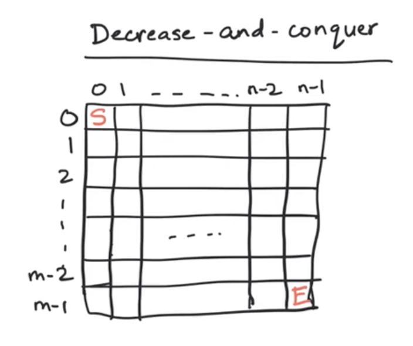

- We used a d&q approach to climb the stairs but that was 1D by looking at the last move.
	- it was either 1 step (previous step) or 2 steps (previous previous step).
	- f(n) = f(n-1)+f(n-2)

We should be able to use the same method in a 2D.

We can reach the final spot from the top or from the left:

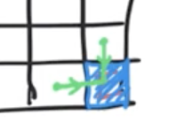

If we know the number of paths from left and top block, we can use lazy manager to calculate the end point.

``` pseudocode
f(m-1, n-1) = #unique paths to (m-1, n-1) from (0,0)
	= f(m-2, n-1) + f(m-1, n-2)
```

**Q:** How many unique subproblems? `m*n`

- we can visualize them as a vertext as in a dependency problem.
	- m*n vertices w/ edges top and left

Again, another topological sort problem; going left to right in each layer / row.

**Q:** What are the base cases?
**A:** 0 column and 0 row don't have neighbors, so we can set this initially
	- only right -> right -> right exclusively
	- only down -> down -> ddown exclusively.

``` swift
func countPaths(_ m: Int, _ n: Int) -> Int? {
    // 2D table of size m*n includes solutions in top sort order
    var table: [[Int?]] = Array(repeating: Array(repeating: nil, count: (n)), count: (m))
    
    // base cases
    for i in 0...m-1 { // column 0
        table[i][0] = 1
    }
    
    for j in 0...n-1 { // row 0
        table[0][j] = 1
    }

    // go row by row from 1 to m-1 and 1 to n-1
    for row in 1...m-1 {
        for col in 1...n-1 {
            guard 
                let a = table[row-1][col], // from top
                let b = table[row][col-1] // from left
            else { continue }
            // store the value of table[row][col]
            table[row][col] = a+b 
        }
    }

    return table[m-1][n-1]
}
```

**Time Complexity:** `O(mn)` because of the for loop

**Space Complexity:** `O(mn)` because of the table matrix

---

``` swift
func countPaths(_ m: Int, _ n: Int) -> Int? {
    // 2D table of size m*n includes solutions in top sort order
    var table: [[Int?]] = Array(repeating: 
                                    Array(
                                        repeating: nil, 
                                        count: (n)
                                    ), 
                                count: (m)
    )
    
    // base cases
    for i in 0...m-1 { // column 0
        table[i%2][0] = 1
    }
    
    for j in 0...n-1 { // row 0
        table[0][j] = 1
    }

        // go row by row from 1 to m-1 and 1 to n-1
    for row in 1...m-1 {
        for col in 1...n-1 {
            guard 
                let a = table[(row-1)%2][col], // from top
                let b = table[row%2][col-1] // from left
            else { continue }
            // store the value of table[row][col]
            table[row%2][col] = a+b 
        }
    }

    return table[(m-1)%2][n-1]
}
```

**Q:** What if we only used two layers?

**Space Complexity:** `O(2n)` or `O(n)` because only using two rows

If the rows were smaller than the number of columns, this wouldn't be as efficient because it'd better to reuse column space instead of row space. 

**Space Complexity:** `O(2m)` or `O(m)` because only using two rows

### Counting unique paths in a grid using DP Quiz

> **Q-1:** The number of unique paths from the top left to the bottom right cell of a 3 x 3 grid is (assuming each step is a move to the right or down): 

**A:** 6; m = n = 3 in this problem. C(m+n-2, m-1) = C(4,2) = 6

> **Q-2:** The number of unique paths from the top left to the bottom right cell of a 5 x 5 grid is (assuming each step is a move to the right or down): 

**A:** 70; m = n = 5. So C(m+n-2, m-1) = C(8, 4) = (8x7x6x5)/(4x3x2x1) = 70

- what if it was 10x10? c(m+n-2, m-1) = C(18, 9) = （18*17*16*15*14*13*12*11*10)/(9*8*7*6*5*4*3*2*1) = 48,620.
	- huh, so some kind of cascading (n-1)*(n-2)... 1 thing

> **Q-3:** The number of unique paths from the top right to the bottom left cell of an m x n grid is (assuming each step is a move to the left or down): 

**A:** C(m+n-2,m-1)

> **Q-4:** The number of unique paths from the bottom right to the top left cell of an m x n grid is (assuming each step is a move to the left or up): 

**A:** `C(m+n-2,n-1)` or `C(m+n-2,m-1)`; This is also a flipped version of the same original problem and so the analysis is still the same. Note that C(m+n-2,n-1) = C(m+n-2,m-1) so there are two correct solutions. 

> **Q-5:** If the CountPaths problem was modified to allow for a diagonal move (in the down-right direction) in addition to the two existing moves, the ONLY change needed in the code to handle it is to have the following line inside the nested for loop: 

**A:** `table[row][col] = table[row-1][col] + table[row][col-1] + table[row-1][col-1]`

> **Q-6:** If the CountPaths problem was modified to allow for a diagonal move (in the down-right direction) in addition to the two existing moves, the DP algorithm could be modified to still run in O(mn) time. 

**A:** True

> **Q-7:** If the CountPaths problem was modified to allow for a left move in addition to the two existing moves, the number of unique paths would be: 

**A:** Infinite; Allowing for a left move in addition to right and down moves would lead to the creation of cyclical paths. Once you have cycles, there would be an infinite number of unique paths, each going around a cycle different number of times before exiting it. 

> **Q-7:** If the CountPaths problem was modified to allow for a left move in addition to the two existing moves, we can still get the order in which subproblem vertices need to be solved via topological sort. 

**A:** False


### End of section summary:

- Now I understand how to shrink the space complexity now using 2 layers and %2 on rows 🎉
- if column are larger than rows, it's better to reuse column space instead of row space.
- Just because we are going from `s` to `e` doesn't mean this is a quickest path problem. So that means, if we our bot could go left, right and down, it would would have inf choices unless the sole purpose was to get to a spot asap.

</details>

---

# Optimization problems

## Maximum path sum

<details>
  <summary>View Notes</summary>

### Recap

1. we started with counting problems
2. now we will look at optimization problems

Optimization problems can consist of two variations:

1. minimize - some overall value
2. maximize - some overall value

DP was original created for this kind of problems.

---

Back to the problem where the robot could move left or down. In the optimization problem version, each grid will have a value. For example, how much it will collect of an item at each block.


- The value of the path is the sum of all the steps taken in that path.

We want to find the maximum path - which path collects more? and can we keep track of the path?

- computing the value of each one is bad because it'll be exponential there has to be a better way.

### Let's try a decrease and conquer method again:

- the movement is the same from top and from left
- the value of top is x and the vlaue of left is y, we can compute the max path of the bottom right cell:

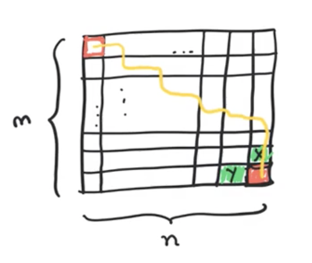

We can make the following claim (This is called optimal substructure):

- if `S ---> E` is the best path
- `S ---> an arbitrary T` is the best path to `T`
- then any prefix of it is also the best path
	- the best path to T is a prefix to the best path of E from S

What does optimal substructure allow us to do?

- If i know the opt path to both of me neighbors, I can extend it by 1 more step
- compute:
	- x + points in my cell
	- y + points in my cell
	- then compare the two. Which ever gives a large number, we take that path

In a simple solution, we'll have a lot of repitions:

``` swift
func maxPath(grid: [[Int]]) -> Int {
    let m = grid.count
    let n = grid[0].count
    var table: [[Int?]] = Array(repeating: 
                                    Array(
                                        repeating: nil, 
                                        count: (n) // n
                                    ), 
                                count: (m) // m
    )
    
    // Initialization
    
    // table[i][j] will store the value of the max path from (0,0) to (i,j)
    table[0][0] = grid[0][0] // start at "s"
    
    for j in 1...n-1 { // all the values in row 0 will include their best path values
        table[0][j] = grid[0][j-1] + grid[0][j]
    }
    
    for i in 1...m-1 { // all the values in column 0 will include their best path value
        table[i][0] = grid[i-1][0] + grid[i][0]
    }
    
    // we did these two for loops because they don't have a max only calculating from above it
    
    // traverse through the entire matrix row by row (left to right)
    
    for row in 1...m-1 {
        for col in 1...n-1 {
            // fill in value of table[row][col]
            table[row][col] = // the optimal value
                grid[row][col] + // my points
                max(table[row-1][col]!, table[row][col-1]!) // pick the best value between the top or left
        }
    }
    
    return table[m-1][n-1]! // optimal value for m/n (bottom right most point)
}

```

- we can view each cell as a vertex and edges as the left or top:

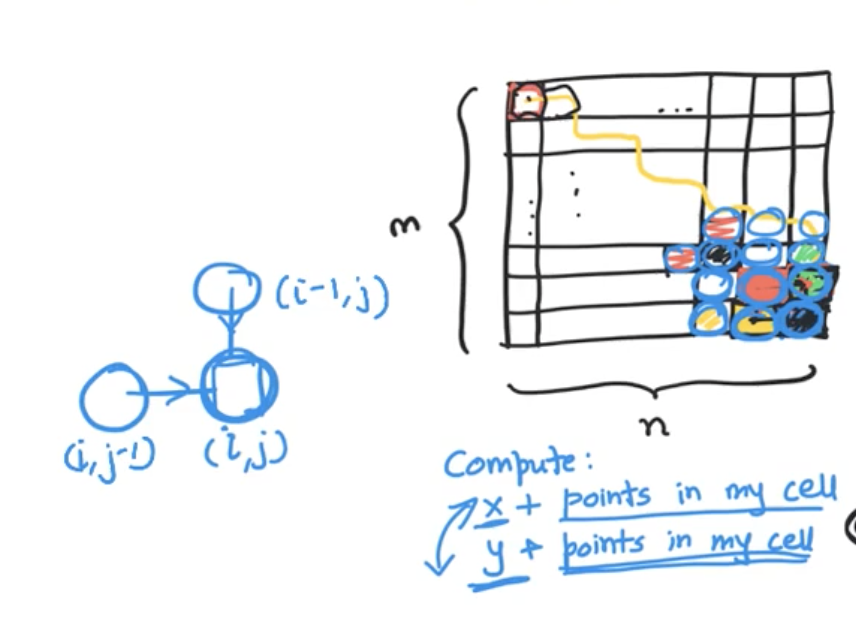

**Time Complexity:** `O(mn)` because of the for loop

**Space Complexity:** `O(mn)` because of the table matrix

What if we had to return the optimal path itself?

- we'd need to keep a record from the value in max():

What if we wanted to get the min collected value?

- we'd use the `min(table[row-1][col]!, table[row][col-1]!)` instead

---

1. Let's try it on the sample grid:


2. the optimal value for the edges:


3. the optimal value for the first max from left or top:

  

4. Final solution:

  


### Maximum path sum Quiz

- I went through them but trying speed up study so paste these in later: https://uplevel.interviewkickstart.com/resource/rc-resourcecollection-205600-491360-164-910

### End of section summary:

- Optimization problems related to min and max problems
- Using a matrix seems to be the proper way to path sum
- We could have used a copy of the graph and manipulated it there
- We used a decrease and conquer method in this problem
- if S-->E is the best path, S-->T or T-->E where T is optimal is a prefix to the path
- max and min on the movement gives max or min of the path
- Timecomplext and space complexity (currently) are the same as previous O(nm)

</details>

## Minimum cost stair climbing

<details>
  <summary>View Notes</summary>

### Optimization problem of stair climbing

- this is a 1D optimization problem 
- so each step has a "cost" that is obtained when landing on it

  

Find the cheapest way to climb up:

- no cost in the floor above or below (in agree)
- highest: if we took every step `10+15+20=45`
- min: 15 - stepping the middle stp

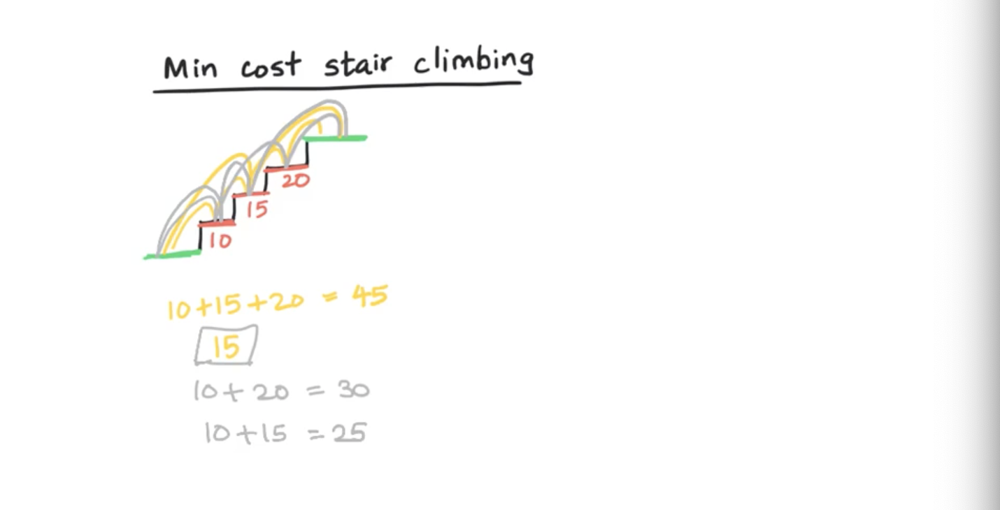  

enumerating this solution would be exponental. we can get this in polynomial time, so we need to solve this without repitition.

### Decrease and conquer method:

- the same prefix claim is valid here where S->E, S->T is optimal. 
	- optimal substructure

``` swift
func minCostStair(_ stairs: [Int]) -> Int {
    var table = stairs
    table[0] = 0 // give the start a 0 for the green part
    table.append(0) // give the end a 0 for the green part

    let n = table.count-1

    
    for i in 2...n { // starting at 3 since 1 and 2 are base cases
        if i == 0 { continue } // 0 is always the same
        table[i] = table[i] + min(table[i-1], table[i-2])
    }
    
    return table[n]
}

print(minCostStair([10,15,20])) // 15
```

**Time Complexity:** `O(n)` as we are traversing the entire array

**Space Complexity:** `O(n)` // only the array

---

### Maximum path sum Quiz

- I went through them but trying speed up study so paste these in later: 
https://uplevel.interviewkickstart.com/resource/rc-mcq-205600-491360-103-524-2651235


### End of section summary:

- this is a 1D optimization problem
- we can copy the stairs array and append 0 to start and end to make things eaiser.
- this isn't that different from the previous matrix s-e path problem just it's 1D
- it doesn't make since to use max if all the values are positive, unless we are looking for the highest collection path, as max would just be step after step. 
	- negative numbers would change that.

</details>


## Coin change using Greedy strategy

<details>
  <summary>View Notes</summary>

### The coin change problem

> A cashier gives change to customers (only coins). They need to use the fewest coins possible whenever they give change.
>
> Given: coins of different deominations and a total "amount" of money, computer the fewest number of coins that you need to makeup that amount?
>
> example: coin: [1,2,5] amount: 11 units
> 		5+5+1=11 means: 3 coins
> What is the fews coins with an unlimited supply?
> 	return -1 if no valid change amount


Steps to solve the problems:

1. what kind of problem is this? 
	- minimization problem (optimization prob), which means DP
2. How to solve? 
	- Brute force is exponental so decrease and conquer
3. 

- [x] I think it can use subtraction, lets see if i'm correct
	- maybe even division for the DP

### Greedy Strategy

Subtraction and division but can also be addition by bounds and moving down to smaller coins. This is called Greedy Strategy. -- seems I might be right!

Example: 253 = 253/5=Int(50) = 250+2 = 252+1 = 253

---

What if we change the coins to [1, 5, 7] and amount 10:

- if we pick 7 (largest) but then we'd need to pick `1` 3 times.
	- 7+1+1+1=10 (4)
- but 5+5=10 would be less coins (2)

in this case the greedy strategy wouldn't work.
- so I was wrong, it works in some cases but not all.

### End of section summary:

- Greedy Strategy doesn't always work for finding the minimum of a problem
- the max of the coin problem would be the smallest amount

</details>


## Coin change using DP

<details>
  <summary>View Notes</summary>

### The coin change problem

> Given: coins of different denominations
>		coins=[1,2,5]
>
> and a total amount of money:
>		amount=11
>
> computer the fewest # coins needed to make that amount

- [x] Always be thinking "the greedy" problem will never work!

### Steps to solve the problems:

1. what kind of problem is this? 
	- minimization problem (optimization prob), which means DP
2. How to solve? 
	- Brute force is exponental so decrease and conquer
		- this is the hardest part so:
		- break it up into any optimal solutions
3. Identify all the different prossible subproblems
4. Identify the dependency graph
5. Identify the data structure - cache the solution to the subproblem 1D or 2D table

Optimal Substructure:

- why is it so important?
	- because i can now become a lazy manager and determine the last coin that would lead to amount `a`
- think of the last coin to hit `a`

  

Since there are currently 3 different coins, we would have to call 3 separate subordinates to solve their part of the solution for it. "Find the optimal way to get a-5 or a-2 or a-1", they come back with optimal solutions.

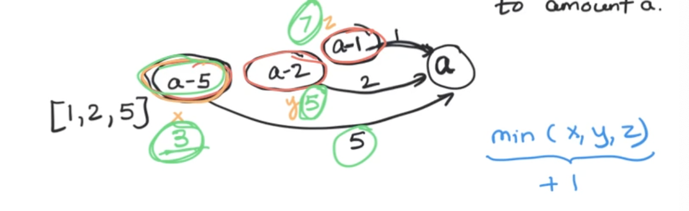  

Which of the tree do I pick? min(x,y,z) + "1 coin of any denomination"

### step 2: recursion problem:

``` pseudocode
let f(a) = fewest # of coins needed to make amount a // my problem

coins = [c, c2, c3, ... ck] // can be any sequence. so we call k subords

f(a-c1) <- subord
f(a-c2) <- subord
f(a-ck) <- subord

then I use the fews number of the subord

f(a) = min_k(f(a-ck))+1 // step 2 is complete
```

### step 3: Identify all the different prossible subproblems

- a+1 distinct subproblems possible

### step 4: Identify the dependency graph

- why? so we can determine which order to compute the subprob solution in
	- top sort order to compute the solution
		- left to right
- each subprogram -> vertex
- the edge depends on (a-ck)


### step 5: Identify the data structure used to store subproblem solutions

`table[i] = the solution of subproblem of size i = f(i)`

### step 6: program the DP algo

``` swift
func coinChange(amount: Int, coins: [Int]) -> Int {
	var table: [Int?] = Array(repeating: nil, count: amount+1)

	// base case
	table[0] = 0 // no coins needed

	var minValue = Int.max

	// traverse the array
	for i in 1...amount {
		// compute and store the solution of f(i)
		for c in coins {
			if i-c >= 0 {
				minValue = min(minValue, table[i-c]) // which of the minValues is the smallest

			}
		}
		table[i] = 1 + minValue 
	}

	return table[amount] ?? -1
}

```

We could do the above without the minValue by just initializing the table with `Int.max`

``` swift
func coinChange(amount: Int, coins: [Int]) -> Int {
    var table: [Int] = Array(repeating: Int.max, count: amount+1)
    
    // base case
    table[0] = 0 // no coins needed
    
    // traverse the array
    for i in 1...amount {
        // compute and store the solution of f(i)
        for c in coins {
            if i-c >= 0 {
                table[i] = min(table[i], table[i-c]) // which of the minValues is the smallest
                
            }
        }
        table[i] = table[i] + 1
    }
    
    return table[amount] ?? -1
}

print(coinChange(amount: 10, coins: [1,5,7])) // 2

```


---

**Time Complexity:** `O(a*k)` as we are traversing the k and amount

**Space Complexity:** `O(a)` // only the k array

### Quiz


### End of section summary:

- Greedy strategy should be avoided at all costs, even if it's possible to do. You'll need to prove it to the interviewer and it might take longer than just doing DP

The 6 steps to solving a DP problem:

1. what kind of problem? Is it optimization or counting?
2. How do you solve it? Decrease and conquer seem to always be the answer
3. Identify all the different possible subproblems?
4. Identify the dependency graph
5. Identify the data structure - 1D or 2D table

</details>


## Footnote

<details>
  <summary>View Notes</summary>

### Richard Bellman invented DP

- due to politic avoidance, he picked the word programming and dynamic to hide that he was working in mathmatics and research.

</details>