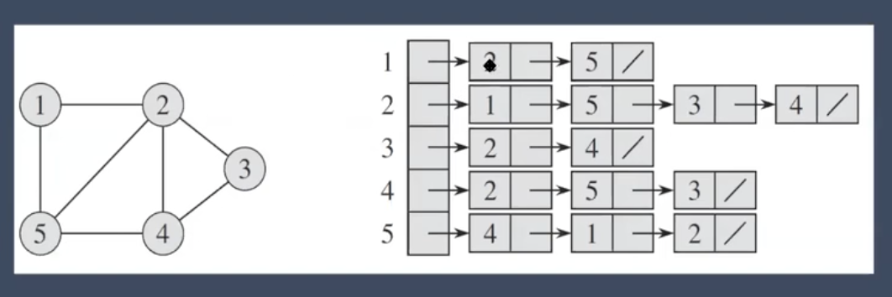
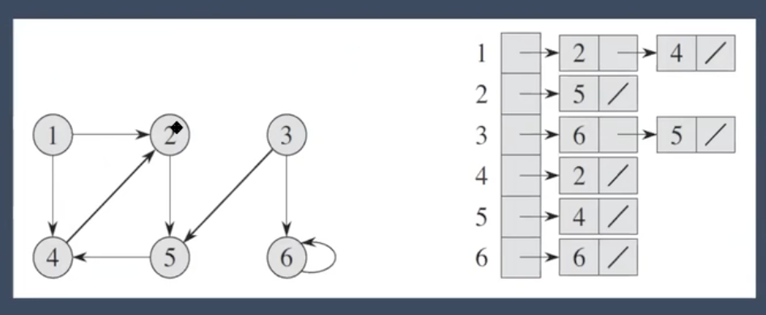
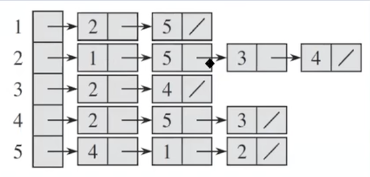

# Live Graphs with Li WangLive Graphs with Li Wang

Fortunately, they opened the alternative classes before Sunday's class. So here's a few notes before tomrrow

----

## Question
- Given the graph below:
	G = (V,E)
	V = {1, 2, 3, 4}
	E = {(1,2)(1,3)(3,2)(3,4)(4,3)}

**Q:** How do we know whether vertex A can reach vertex B directly or not?

- My initial thoughts: If A and B share an edge found in E they are directly reached.

**Q:** What are the neighbors of a vertex?

- My initial thoughts: The neighbors are the vertex that share an edge with a given vertex (source)

- The answer to both questions is by parsing the edges. 
	- We should be able to do this in constant time by preprocessing the data (Adjacency matrix)

**Q:** Time complexity of both operations: 
	- `O(|E|)`

# Adjacency matrix 
- Works for both Undirected Graph and Direction

### Implementation:

``` c++ (it's Swift)
class Graph {
	var matrix = [[Int]]()
	var n: Int?

	func makeGraph(n: Int) {
		self.n = n
		self.matrix = Array(repeating: Array(repeating: 0, count: n), count: n)
	}

	func addEdge(start: Int, end: Int) {
		self.matrix[start][end] = 1
	}
}
```

Using the above code, we'd generate the graph with: 
	- `n = v.count` 
	- Then we'd mark `1` or `0` depending on `|E|`

``` perl (it's Swift)
let graph = Graph()
graph.makrGraph(n: v.count-1)

func preprocess(e: [(Int, Int)]) {
	for edge in e {
		graph.addEdge(start: edge.0, end: edge.1)
	}
}
```

Which would output:

``` c
[
	[0, **1**, 0, 0, 1], 
	[**1**, 0, 1, 1, 1], 
	[0, 1, 0, 1, 0], 
	[0, 1, 1, 0, 0], 
	[1, 1, 0, 1, 0]
]
```
Example: `(1,2)` && `(2,1)` in bold

NOTE: ==You'll notice these are symetrical if folded down the center for undirected==

Time Complexity:
	- `O(1)` time to check whether 2 vertices are directly connected or not
		- using a matrix has went from O(|E|) to O(1)
	- `O(|v|)` time to get all neighbors of a vertex

Space Complexity:
	- `O(|V|^2)` because it's a matrix

# Adjacency List

Undirected Graph:



---

Directed Graph



Time Complexity:
	- `O(|V|)` time to check whether 2 vertices are directly connected or not
		- because we need to parse the list of neighbors in each stored index.


	- You'll notice here that to see if `2` is connected to `4`, you'll need to parse index 2 to verify it

	- `O(1)` time to get all neighbors of a vertex
		- because it's already in a list 
			- (still not sure what the code looks like for this)

Space Complexity
	- `O(|V|^2)` space (worse case)
	- `O(|V| + |E|)` space if each vertex connects to k vertices on average


### Example Implementation

Creating a list object
``` perl (it's swift)

var adjList = Dictionary<T, [T]>()

```
- swift doesn't have a list object natively
- So we need to create a hashable Dictionary `T` with array of `T`

``` perl
class Graph<T: Hashable> {
	var adjList = Dictionary<T, [T]>()
	var n: Int? # number of vertices

	func graph(n: Int) {
		self.n = n
		for i in n {
			adjList[i] == LinkedList() # empty linked list item? It's not very clear
		}
	}

	func addEdge(start: Int, end: Int) { # end is neighbor
		adjList[start].append(end) # appending the connected vertex to current start vertex
	}
}
```

- The above only works for integers hence the `<T: Hashable>` addition

### Drawbacks fo Adj Lists

- We can't store a weight
- Can't achieve O(1) time

**Q:** What can we use instead?
**Discussion A:** Maybe a map or a map?
**A:** Adjacency Map

# Adjacency Map

``` java
class Graph {
	// Vertex		vertex, weight
	Map<String, Map<String, Double>> adjMap;
	String[] vertices;

	public Graph(String[] vertices) {
		this.vertices = vertices
		this.adjMap = new HashMap<>();
		for (String vertex : vertices) {
			adjMap.put(vertex, new HashMap<>());
		}
	}

	void addEdge(String start, String end, double weight) {
		adjMap.get(start).put(end, weight);
	}
}
```

Seems both Adjacency List and Adjacency Map are not very straight forward in swift. 

[What is the equivalent of a Java HashMap<\String,Integer/> in Swift](https://stackoverflow.com/questions/44637836/what-is-the-equivalent-of-a-java-hashmapstring-integer-in-swift)

Seems people suggest using a dictionary

``` perl (it's swift)
var adjMap = [String: [String: [Double]]]()

```

- Adjacency Map uses a hashmap to store the neighbors of vertex `v`, instead of using a list
- No more iteration over the neighbors (like in adjacency list), O(1) if `u` is a neighbor of `v` and to get the edge weight of `(v,u)`
- Adjacency map combines the advantages of adjacency list (in space) and adjacency matrix (in time).

NOTE: if edges don't have weight, we can use adjacency set instead.

`Map<String, Set<String>> adjMap;`


In Swift maybe this should look like this:

``` swift
var adjMap = [String: [String: [Double]]]()

adjMap["word"] = ["Text", [20.0]] // we need a better way to init "Text"
adjMap["word"]?["Text"]?.append(30.0) // too many optionals imo
```

Output:

``` swift
[String : [String : [Double]]] = 1 key/value pair {
  [0] = {
    key = "word"
    value = 1 key/value pair {
      [0] = {
        key = "Text"
        value = 2 values {
          [0] = 20
          [1] = 30
        }
      }
    }
  }
}
```

## Exercise

**Q:** Build a undirected graph based on binary tree (A part of a FB interview Q)

- My thoughts: First we know we need an array of vertices and array of edges. 
	- Parent would be a vertex.
	- left and right would be the neighbor so parent to child = `e`

``` perl
class TreeNode {
	var value: Int
	var left: TreeNode?
	var right: TreeNode?

	init(value: Int) {
		value = value
	}
}

var vertices = [Int]()
var edges = [(Int, Int)]()

func buildUndirected(root: TreeNode?) {
	guard let root = root else { return }

	vertices.append(root.value) // set vertex by parent value

	if let left = root.left { // left edge to child
		edges.append((root.value, left.value))
		buildUndirected(root: left)
	}

	if let right = root.right { // right edge to child
		edges.append((root.value, right.value))
		buildUndirected(root: left)
	}
}

```

^ this is a DFS approach. The teach ended up building the answer as a Adjacency Map but it is good enough for understanding until I can figure out how to build an A-Map in Swift.

==See Leetcode question 863. All Nodes Distance K in Binary Tree==

https://leetcode.com/problems/all-nodes-distance-k-in-binary-tree/

----

# Is it a graph problem?

- determine whether the data in the problem can be modeled as vertices or not?
- Determine whether the vertices are connected or not?
- if both answers are YES, then we can model that problem as a graph problem
- ==Identifying the category of the question is the first thing you should do after you fully understand the question in the interview!==


