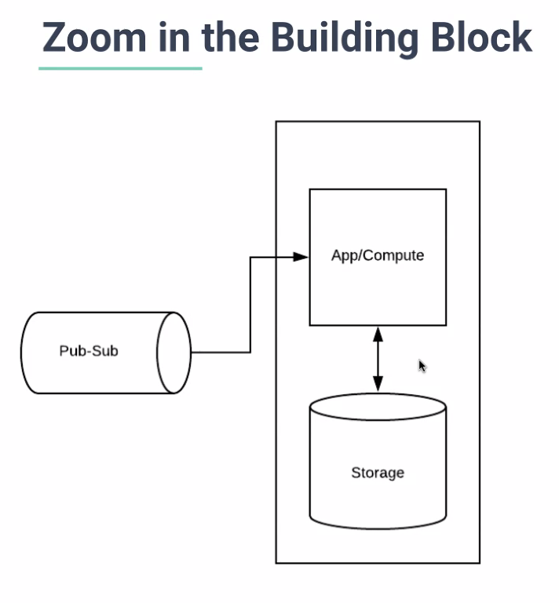
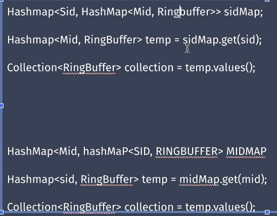
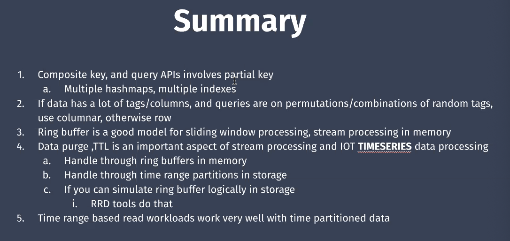
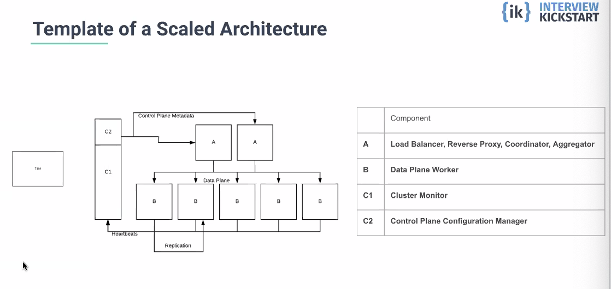

# Live Scalable Systems Supplementary Class with Niloy (OPTIONAL)

# Building a streaming service - APM

Streaming processing and analytics

## problems statement:

imagine a data center where hundreres of servers (1000) each emiiting thousands of metrics per second (2000)

such as CPU utilization, memory utilization

we need to build a central brain that ingest the servers and dashbaord

1. given a server id, return min, max avg of all metric within a time window of 2 days
	- at a granularity of 1 min
2. given a metric id, return min, max, avg of all servers within a time window of 2 days
	- at a granularity of 1 min
3. Given a server id and a time range, return min, max, avg of all metric
4. Given a metric id and a time range, return min, max, avg of all servers

Data will live for a year

---

## Non-functional requirements

- small data size but quick retrieval
- gran of 1 minute helps with reduction of cost
- 2 million per minute
	- 30k a second
- TTL is one year

Throughputs:

- 3 reads, 1 write = 5 apis in totals
- write heavy system 2 million per minute

## Microservices

- data collection 
	- pub/sub
	- the source doesn't care if consumption 
	- broker
	- lets consumer come in its own pace
	- example:
		- buy a house seller is the producer. buyer is the consumer. bank is the pub/sub transfering the money to the seller while getting paid by the consumer.
		- kafka: https://thisaru.medium.com/creating-a-local-kafka-cluster-for-testing-a-weekend-project-5d47e97fa9b1
- data aggregation and api service (central brain/stream processor)
	- app server tier - consumpution
	- in memory tier 
		- has the same logic and data model but organization and amount of data differs
		- (two days)
	- storage (1 year)

## Designing stream processing and analytics MS

example: trending: https://trends.google.com/trends/trendingsearches/realtime

## Building blocks

- App tier
	- handles consumption of event from pub-sub or message queue
- in memory tier
	- stores a window of most recent time series events
	- performs lightweight workloads on recent events
- storage tier
	- stores for a larger time window duration
	- performance more heavyweight analytics on historical data
- tier handling
	- app tier handled by app team
	- computer tier logic handles by application teams, infa handled by infra teams
	- storage tier handled by infrastructure teams

1. **What is round robin?**

Round-robin is one of the algorithms employed by process and network schedulers in computing. As the term is generally used, time slices are assigned to each process in equal portions and in circular order, handling all processes without priority. Wikipedia

# Dataplane / Data model

- solve each tier logically
	- scalle not yet
	- propose data model
	- propose api

## Data model

- K-V: 
	- K: server id, metric id, timestamp
		- Composite key; we need to store all three
	- V: value of metric (data)
	- from pub-sub
- revised data model:
	- k: server id, metric id, 1 min bucket 
	- v: min, max, avg

2. **How do we store this in memory?**

- in memory hashmap
	- hashmap<<server_id, metric_id, timestamp>, <min,max,avg>>

3. **One api is for server_id and one metric_id, how to handle that?**

- two hashmaps of hashmap
	- two different queries
	- server_id -> metric -> timestamp
	- metric -> server_id -> timestamp

- if we don't do this it wont be fast enough to query without knowing.

### Ring buffer
  - In computer science, a circular buffer, circular queue, cyclic buffer or ring buffer is a data structure that uses a single, fixed-size buffer as if it were connected end-to-end. This structure lends itself easily to buffering data streams. There were early circular buffer implementations in hardware. Wikipedia
  - handles TTL really well
  - **What happens when ring buffer is full?**
  	- A circular buffer stores data in a fixed-size array. So once the size is set and the buffer is full, the oldest item in the buffer will be pushed out if more data is added.
  - all cache / snapshots

2 days of data worth of 1 minute nodes: 2880: 60*24*2

**Pseudocode**:

## Storage

- organization in storage
- row oriented
- [server id, metric id, timestamp 1 min]: min, max, avg
- maintain two secondary indexes

## TTL in storage

- time parition date models
- store by days
	- `T_july 20, 2020` -> all the 1 min data for that day + index <sid, mid, tb>: min,max,avg

- only july 21, 2021, drop the partition `T_july 20, 2020`: 
	- it is a file system operation, **which is much fast**
	- drop

# Scaling justification

- scaling for storage
	- depends on ttl, sliding window, aggregation time interfval
- scaling for throughput
	- high throughput ingestion
	- typical low throughput analytics
- scaling for latency reduction
	- typical not applicable

## Template of scaled arch

- horizontal cause scaling for the writes

- scatter gather:
	- https://www.oreilly.com/library/view/designing-distributed-systems/9781491983638/ch07.html