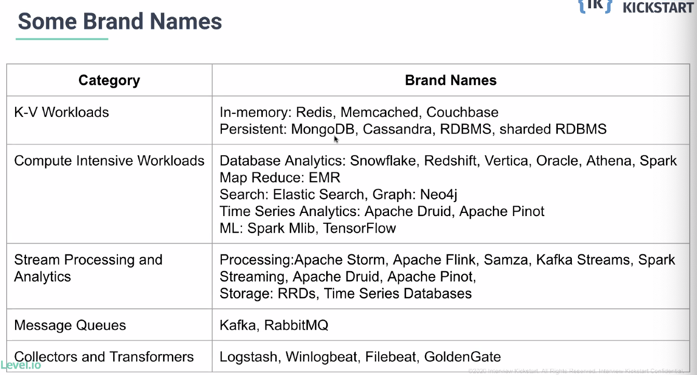
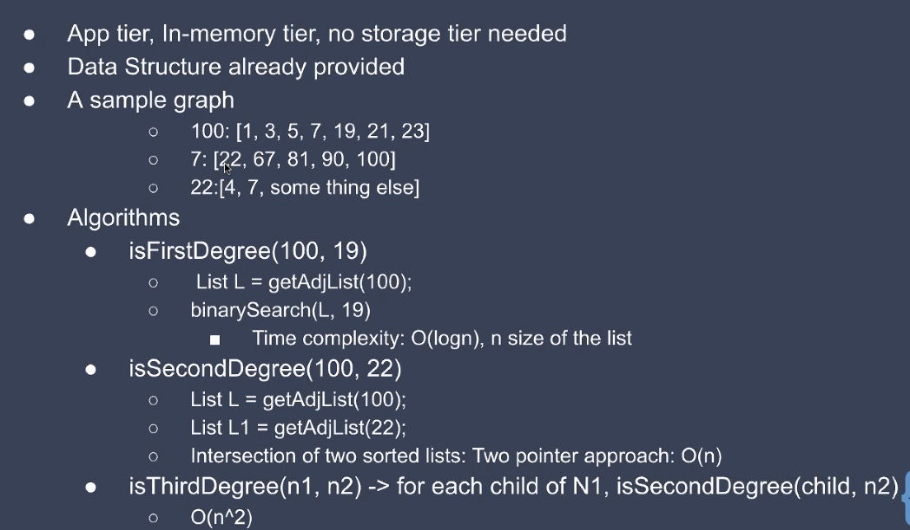
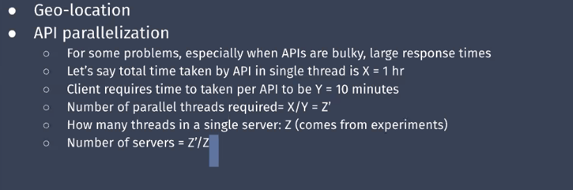
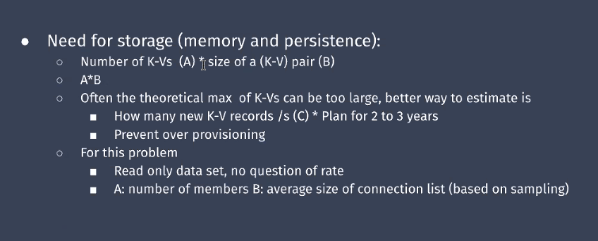
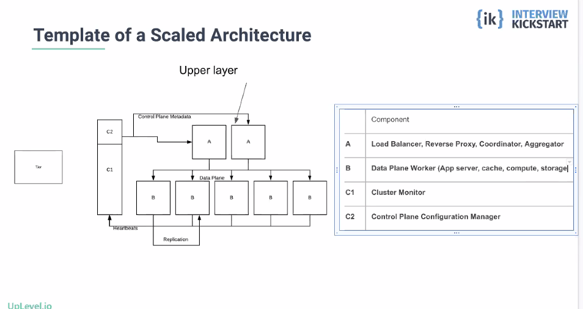
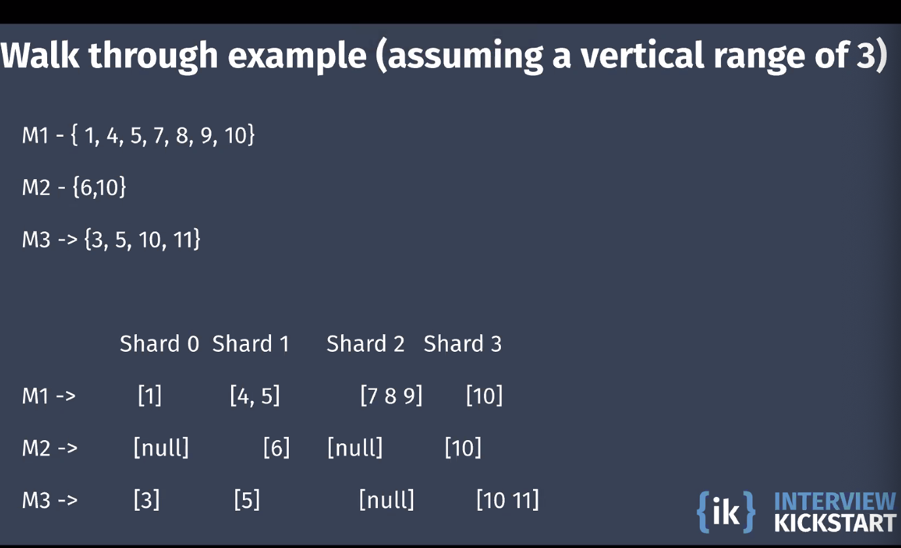

# Live Scalable Systems Class with Niloy

<details>
	<summary>Read more</summary>

## Introduction

- Took IK in 2016
- These are the kind of SD questions to get into LinkedIn

### 3 catories

- online microservice
- compute intensive graph processor
- stream processing

</details>

# High Level Thought Process

<details>
	<summary>Read more</summary>

The first few steps to go through for every design problem:

4 parts:

# Step 1: Wear the Product Management Hat

- treat interviewer as an end-user / customer
- collect functional requirements
	- this is the detailed problem-statement
	- high level
	- ask question to clarify all doubts
	- object would be to be able to visualize 2-3 APIs from the requirements
- collect design constraints
	- numbers, how many, how much
	- required for answer scalability
	- often interviews trow these back to the candidate
		- so it is beneficial to research them

# Step 2: Id building blocks (MS)

- tream the interviewer as a peer
- imagine yourself as a engineering leader irl
- bucketize functional requirements into MS
	- simple high level clustering of requirements

### Fundamental building blocks:

- K_V workloads: (online)
	- Simple CRUD data storage and access
	- constant order time complexities
	- data can be CRUD or timeseries
	- Domain specific Business logic in APIS
	- Examples:
		- shopping cart purchase
		- airline purchase
		- DNS
- Computer intensive workloads: (mostly read only)
	- a single API in bulky and heavily algo
	- high time complexity
	- in memory processing
	- domain specific algo
	- Examples:
		- 90% of Leetcode
		- Algo based
		- batch processing and offline
- Streaming Analytics: (near real time)
	- perpetual data ingeston of time
	- sliding window based processing
	- Analytics complexity not as bad as Computer intensive
	- Examples:
		- Nest
		- AI car driving
		- application montoring

the four basic operations (create, read, update, and delete) of data storage, regarded collectively.


### Bonus:

- Message queues: (arterial)
	- Data brokers: (arterial)
- Collectors, extractors and transformers
	- data transport

# Step 3: Propose umbrealla architecture

- propose logical architecture
	- block diagram of each microserver
	- api gateway to interface between user and system
- propose and explain data.logic flow between them, rule of thumb:
	- if high volume of data needs to be pushed in near time between two MS use Pub-sub

# Step 4: Delegate design of building blocks

- treat this step to development team
- deep dive on each building block at a time
- type ot map each building block as one of the tech types
- interate over and discuss each
- rinse and repeat
- if too many MS or building blocks
	- negotiate with the interview on which one to focus on
	- you only have constant time
	- depending on the number of MS only do 1 or 2

Tip: pick K-V owrkloads

# Step 5: Discuss business Impact (Optional)

- Map functional requirements per MS to the business impact they will have
- A new requirement and gives major bonus points

</details>

# Designing compute intensive building block

<details>
	<summary>Read more</summary>

C ompute intensive graph processor

# Step 1:

## Problem: 

> Design a grpah processer that determines the degree of connection between two memebers in a social graph

- APIs:
	- is FirstDegree(n1, n2) -> returns true if n1 and n2 re connected
	- isSecondDegree(n1, n2) -> returns true if n1 is connected to some x and  is connected to n2
	- isThreeDegree(n1, n2) -> return trues if n1 is ocnnected to some x, x is connected to some y and y is connected to n2

- Graph:
	- in-memory KV store
		- K is userID
		- V is sorted array of 1st gree connections
- undirected grpah
- getAdjList(K) -> reference to the sorted array

In this question everything is given to us, so this is an algo question

What we can interpret:

- static data
- 600 million users
- there is no limit to the number of connections
	- average size is?
- each api has to be fast (100s of ms)
- 40,000 API calls per second

# Step 2: ID MS

From this step, start treating the interviewer as a peer

1. zoom in the MS
2. Solve the MVP
3. scalability justification
4. scaling the MS

Below you can use this same diagram for ever interview of this type:

Compute intensive:


vs K-V:


- Don't mention brand names in interviews but here's some:



### 2 - Dataplane

- solve each tier logically
	- scale is not in the picture yet
	- ID data model
	- propse APIs to match the functional requirements
	- Discuss how data will be stored in stroage and cache tiers
	- propose workflow/algo for the APIs in each tier
	- propose flow across tiers within the MS
		- most of technical design interviews have meat here
		- non-deterministic
		- changes from problem to problem
		- this consitiues most thinking portion of the intreview
		- IMPORTANT: most chances to flunk


### ID data model

- This is an adjList implimentation

### Discuss how data will be stored in stroage and cache tiers

- Hash map of arrays / hash map of linked list

### propose workflow/algo for the APIs in each tier

- Has to be designed by me. So design the DSA

### FirstDegree(n1, n2)

- get adjList
- run a binary search to see if connected (it's sorted)
- `O(Log(n))` b/c binary search

```

```

### isSecondDegree(n1, n2)

#### Wrong approaches:
- don't take extra space is bad because we'll run out of memory
	- so no adjMatrix
- BFS: no because it's memory intensive

#### Possible approach:
- for each nieghbor of n1 is firstDegreen(Neighbor, n2)
	- O(nlogn)

#### Correct approach:
- two pointer pass
	- O(n)




```

```

### isThreeDegree(n1, n2)

- same two pointer but on isSecondDegree(child, n2)

```

```

## Worst worst case?

- there is no limit to the number of connections. So possible that someone is connected to every single user
- why does this matter?
	- because of SLA
		- 100s ms and 40,000 API calls per second
	- SLA should always be worse case

- so scale is requireed

---

# IMPORTANT: Some compute intensive Homework problems to not fail this step:

KNOW THESE ALGOS:

1. web crawler
2. text search
3. Graph problem (this one)
4. recommendation systems
5. feed generation (fb, twitter)
	- how does a tweet appear
6. route planning in maps

---

# Step 3

- determinist set of reasons and be posted across all interviews
	- need to scale for data hosting
	- need to scale for throughput
		- if throughput is high one server wont be able to handle it
	- need to scale for API/compute parallelization to reduce latency
		- a single API function call has to be run in parallel
		- compute intentsive
		- ALMOST ALWAYS DONE ON THESE KIND OF PROBLEMS
	- need to remove hotpsots
	- avaiability and geo-distro
- the constraints or number change from problem to problem
- solve algebraically first and then put numbers
	- algebraic solution is the same for all problems
- if dataplane phase take more time, do not spend time on calc/estimations

### parallelization to reduce latency

- 600 million users, yes
- divide the algo into mutliple servers or use mutliple threads




### need to scale for throughput

- 40,000 api calls
- each API has to be fast (100s of ms)




# Step 4: scale the MS

- Cons: 
	- Cost with scalability (Cost of Goods)
	- it's not free

- IMPORTANT: Reusablable diagram for ever interview



- cluster monitor (c1/c2)
	- example: zookeeper
	- ensures tasks isn't sent to dead worker

# What is sharding:

- partitioning for scalability
- map data or KV to shards
- virtual partitions (namespace)
- shards are placed in servers
- two way mapping
	- data -> shards
	- shards -> servers
	- data <-> servers
- Why not 1 way mapping:
	- because we don't change the algo
- IMPORTANT: How do you know which sharding:
	- horizontal sharding: *(most of the time this type)*
		- sharding by keys
		- reverse proxy 
			- hash function on key 
			- range function key: range(keyx, keyy) -> shard
		- why? 
			- has to be random choice else can't load distribute
			- keys must present in all APIs
	- vertical sharding: *(compute intensive)*
		- sharding by value
		- when it's a list
	- hybrid sharding:
		- both by key and value

- depends on time complexity to decide on horizontal or vertical
	- example: if width > height; horizontal
	- example: if height > width; vertical
	- example: select * from table;
		- horizontal because * while table is constant
			- number of records (rows) is the bottle neck

This problem sharding:



- similar to document indexing
- dividing by 3 (0-3, 4-6, etc)
- O(log3) worse case
- this is map reduce

# !IMPORTANT: Cheat sheets


</details>


# Design Netflix

<details>
	<summary>Read more</summary>

</details>