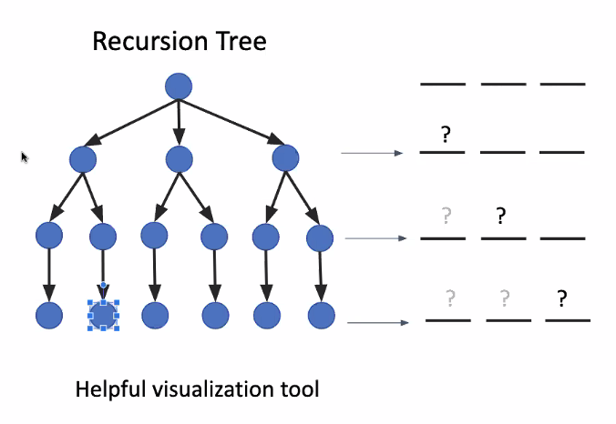
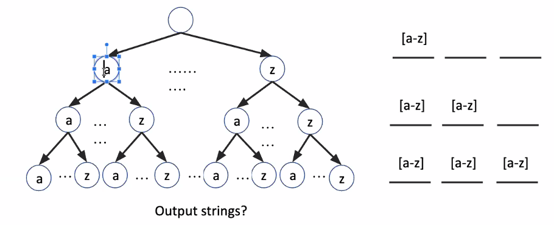
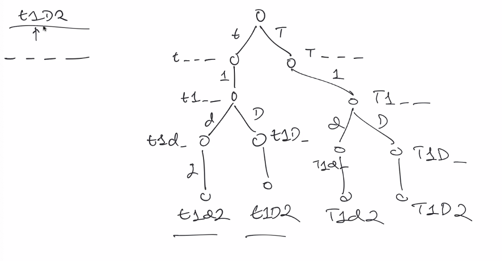
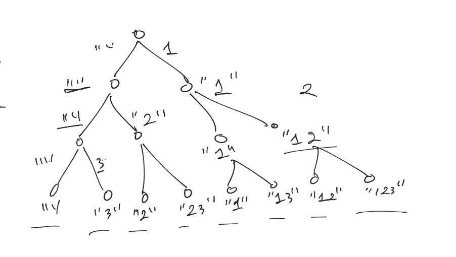
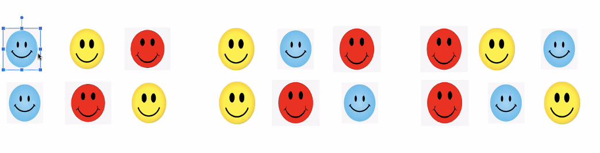
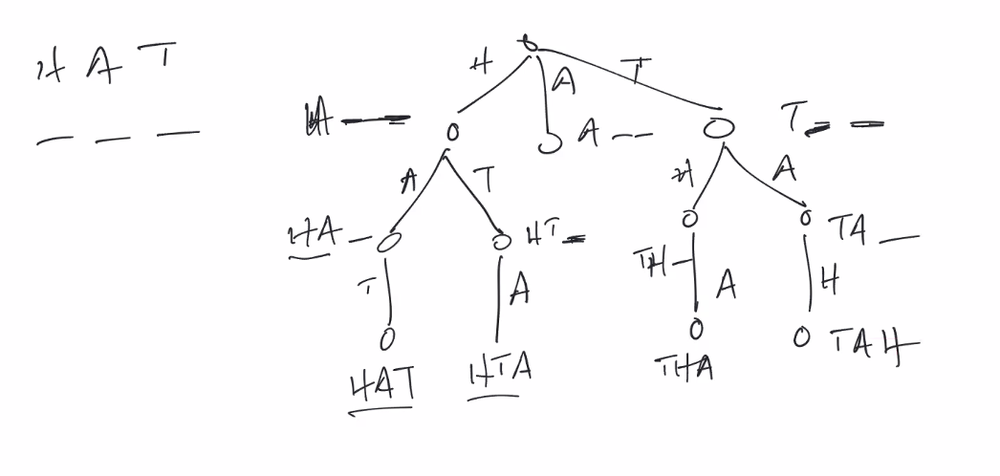
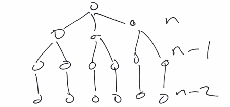
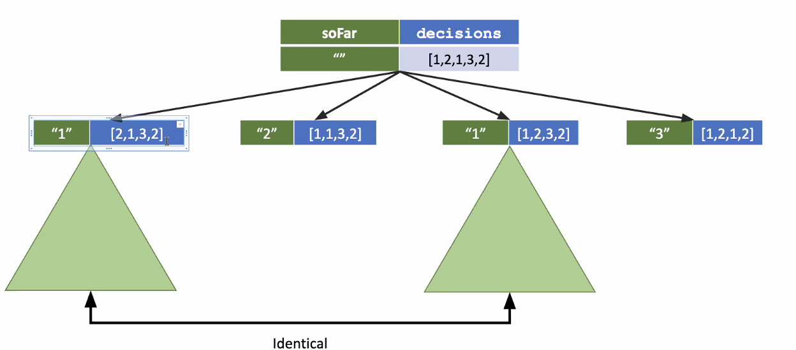
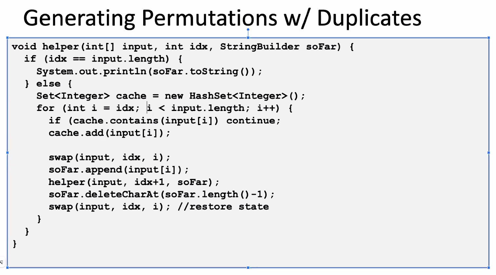

## Class Agenda: 

Part 1: Combinatorial Enumeration interview problems involving the generation of permutations and combinations
- Letter case permutations
- Subsets I
- Permutations I
- Permutations II
- Subsets II

Lunch/Dinner break

Part 2: Backtracking problems, involving the addition of a constraint filter on top of part 1
- Combinations
- Subset sum
- Generate Parentheses
- N-Queens


## Notes

### Questions

1. Where recursion is used?
	- Sorting, combinatorics , DP, Tree, Graphs

2. How would you explain recursion to a 4 year old?
	- My thought: repeating instructions until a solution is found
	- unpacking a present with multiple boxs instead until the last box opens to candy

3. 

-----

# Combinatorial problems

### Layers of complexity

```
	generate / enumerate all possilbe combos -> subsets, permutation

		|
		v

	Apply constraints or filters -> Backtracking (size, sum, cpacity)

		|
		v

	Perform optimization -> DP, greedy
```

### Runtime

- Exponential runtime
- generation (return, print)
- enumerate (how many)

### Mental Model

- fill in a series of blanks (recursion)
	- from left to right
- recursion tree

Every time we solve a problem ask these two questions:
1. How many blanks?
2. What our our choices?

After we have a choice, we must enumerate
Then we ask the same questions:
1. How many blanks
2. What are our choices?




For example:
	A problem with 3 blanks at each level it's one less choice.

#### Example Combinatorial problems

1. Generate all 3-letter strings (print or collect)
	- how many blanks? 3
	- how many choices? 26 choices: A-Z
	- The choices are the same for every blank meaning it's possible to repeat




Pseudo code:

```
driver() {
	helper(sub problems, partial solution)
}

helper(sub problems, partial solution) {
	if no more sub problems
		print or collect

	else 

		for each choice
			make a choice // add to partial solution
			helper(remaining sub problems, partial soltuion)
			unmake a choice // if mutable data structure if used
}
```

2. Letter case permutation - given a string S
	- transform every letter to lowercase or uppercase to create another string
	- return a list of all possible strings we could create

```
	example:
		input "t1D2"
		output ["t1D2", "t1d2", "T1D2", "T1d2"]

		input "12345"
		output ["123456"]
```

Ask the question:
1. How many blanks: 4 blanks, length of string
2. What are our choices?
	- blank 1: t or T
	- blank 2: 1 
	- blank 3: D or d
	- blank 4: 2



``` swift

func lowUpper(_ input: String, _ index: Int, slate: String, output: inout [String]) {
	
	if index == input.count { // base case
		output.append(slate); return // leaf level
	}

	let currentChar = input.char[index]

	// exploring choices
	if currentChar.isDigit() { // digit
		lowUpper(input, index+1, slate: slate+currentChar, output)
	} else { // letter
		// two choices; lowercase & uppercase
		lowUpper(input, index+1, slate: slate+currentChar.toLower, output)
		lowUpper(input, index+1, slate: slate+currentChar.toUpper, output)
	}

}

var result: [String] = []
helper("t1D2", 0, slate: "", output: &result)
print(result)

```

After you have the algorithm, you must be able to explain both:
1. time complexity
2. space complexity
3. (optionally) implicit space

#### Time complexity

O(2^n) @ leaf level

Number of nodes: (2^n+1)+1 if full binary tree if the string only contains letters

!important: to figure out how long it takes, take the `number of nodes times the number of calls`

If it is a digit:
	- O(n)

if it is a letter:
	- O(n)

>> Why is a letter only `O(n)` if we are calling it twice in else?
**A:** `n` because we append the final result to the array, which is taking O(n) time
>> My understand now; because each helper only take n time there's no for loop or something. Just n time.

#### Space complexity + Implicit space

`O(2^n * n)` where n is the size of the input string

where 2^n is all the node

where n is the height of the tree

##### Implicit space

Space from top to leaf node in a single path

`O(n^2)` or height of the tree

- formula:
	height of the tree (n) * amount of space per level (n) 

```
s(n) = O( _ * _ )
s(n) = O( n * n )
s(n) = O(n^2)

```

so in total:

```
s(n) = O(2^n * n + n^2)
```

>> I have no clue how they got there
**A:** The appending `slate+currentChar.toLower` is an implicit we can't control it but it's creating a new string each time. The height of the tree is `n`, 

-----

### Sandwich Model version

Using a buffer append instead of creating of passing a new string

``` pseudocode

func lowUpper(_ input: String, _ index: Int, slate: [Character], output: inout [String]) {
	
	if index == input.count { // base case
		output.append(slate.toString()); return // leaf level
	}

	let currentChar = input.char[index]

	// exploring choices
	if currentChar.isDigit() { // digit
		slate.append(currentChar)
		lowUpper(input, index+1, slate: slate, output)
		slate.removeLast // currentChar

	} else { // letter

		// two choices; lowercase & uppercase
		slate.append(currentChar.toLower) // append to the string it's not an array
		lowUpper(input, index+1, slate: slate, output)
		slate.removeLast // currentChar

		slate.append(currentChar.toUpper)
		lowUpper(input, index+1, slate: slate, output)
		slate.removeLast // currentChar

	}

}

var result: [String] = []
helper("t1D2", 0, slate: "", output: &result)
print(result)

```

The slate in the buffer version should be `[Character]` because we can easily append and then `toString` it.

------

3. **print** all decimal number with n digits in ascending order

```
Example:

	n = 2

		00, 01, 02, ... 99

```

When a question asks `all` it's a Combinatorial

Questions to ask:
1. How many blanks? 2 because n = 2
2. What are the choices at each blank? 0 to 9 or 10 choices
3. How to represent the partial solution?

``` swift

func driver(digits: Int) {
    var slate: [Character] = []
    helper(&slate, digits: digits)
}

func helper(_ slate: inout [Character], digits: Int) {
    if digits == 0 { print(String(slate)); return }
    
    for i in 0 ... 9 {
        slate.append(Character("\(i)"))
        helper(&slate, digits: digits-1)
        slate.removeLast()
    }
    
}

driver(digits: 2)
```

------ Class Break


# Combinatorial - Generate Powerset

!important: A must know classical combinatorial structure

1. Given a set of distinct integers, return `all` subsets
	- a subset can be empty or all the integers
	- an integer can be a part of or not a part of a subset

```
	Example:
		input [1, 2, 3]
		output: {} {1} {2} {3} {1,2} {1,3} {2,3} {1,2,3}
```

Questions:
1. What are the blanks? 3; ---, 1--, -2-, --3, etc
2. What are the choices for each blank? 2 choice; do we want it in the output or do we not
3. 




``` swift

func helper(number: [Int], index: Int, slate: [Character]) {
	if number.isEmpty { print(slate) return }

	// exclude
	helper(number, index+1, slate)

	// include
	slate.append(Character(number[index]))
	helper(number, index+1, slate)
	slate.removeLast()

}

```

#### Time Complexity

`T(n) = O(2^n * n)`

`2^n` nodes with `n` amount per helper

#### Space Complexity

Since we are not collecting, just printing, so no implicit space. The max size of `slate` at any given point is `n` or number of digits in the array:

`S(n) = O(n)`


If we were collecting slate in an array:

`T(n) = O(2^n * n)`

#### Implicit space

Only discuss implicit space if the interviewer asks. Implicit space is the time combinding certain tasks are done, such as combining two strings, as string+string creates a copy. 

In the above case there isn't implicit space because we have a buffer [character]. 

If there was a string+string, per node, it's n * n or 2^n

-----

# Permutations

Generate permutations - rearrange the members of a set into a sequence & order matters

Formal definition:
	- the number od different ways that a certain number of objects that can be arranged in order from a larger number of objects



1. 3 faces what are the different permutations?

Questions to ask:
1. How many blanks? 3; 3 faces blue, yellow, red
2. number of choices? that's what we are trying to solve

>> Do this problem on your own

2. Given a string of characters, print all possible permutations.

```
	Example:
		input: HAT

```

1. How many blanks? 3; 3 letters
2. What are our choices?
```
Example:
	H__ -> HA_ or HT_ -> HAT or HTA
```



!Important: Once you pick that letter, you cannot pick it again.

>> Look up permutation for cubing and see if it releases

``` swift

func helper(input: inout [Character], index: Int, slate: inout [Character]) {
    if index == input.count {
        print(String(slate))
    }
    
    for i in index ... input.count-1 { // choices
        input.swapAt(index, i)
        
        slate.append(input[index])
        helper(input: &input, index: index+1, slate: &slate)
        slate.removeLast()
        
        input.swapAt(index, i) // restore state
    }
}

var original: [Character] = ["H", "A", "T"]
var slate: [Character] = []
helper(input: &original, index: 0, slate: &slate)

```

>> Something live the above but it's not working. 

#### Time Complexity

`T(n) = O(n! * n)`

The number of choices are 1 less each time we go down, so `n!` because each layer is `n-1` as seen here:




#### Space Complexity

`S(n) = O(n! * n)`


-----

# Permutations with Duplications

1. Given a string of characters, print all possible permutations so that there are no duplicates if the string has duplicate characters or numbers
	- Output should have unique permutation




Pseudocode:




# Leetcode #17

>> Try out this related question

https://leetcode.com/problems/letter-combinations-of-a-phone-number/


-----

# Backtracking

- find one or all possible solutions that meet a certain set of constraints
- incrementally build candidates to solutions
- Abandon a candidate solution as soon as it can't satisfy the given constrainsts

Example questions:
1. n-queen
2. sodaku

### General approach

**incremental approach**
	- perform exhaustive search w/o constraints
	- apply the constraints
		- add the backtracking steps at the appropriate places

**Runtime & space complexity**
	- still exponential in worst case

Psuedocode
```

helper(sub problem, partial solution)
	if violate constraint // backtracking case


	if no more sub problems

```

>> Come back to this part of the video 12:22pm

1. Backtracking problem - setset size

Given two integers n and k, return all possible combinations of k numbers out of 1 ... n

```
Example:
	Input: n = 4, k = 2
	Output:
		[
			[2, 4],
			[3, 4],
			[2, 3],
			[1, 2],
			[1, 3],
			[1, 4]
		]
```

2. Backtrack problem - subset sum

Print all subset of a set of distinct integers - [1,2,3]
	- with sum equals to K = 2

What questions should we ask about the integers?
	1. All positive integers
	2. all positive integers with 0
	3. positive, 0 and negative

3. Backtract Problem - Dice Roll Sum

Given number of dice to roll and a desired sum, print all combinations of dice values that add up to the given sums (must roll all dice)
- each dice has 6 values

```
Example:
	Dice = 2 Sum -7

		{1,6}{2,5}{3,4}{4,3}{5,2}{6,1}
```

What is the approach?
- how many blanks to iterative over? 3 blanks; 3 dice
- what ar the choices of each? 6; 6 sided dice
- what is the base case?
- what does the recursion tree look like?

``` swift

func diceSum(_ numDice: Int, runningSum: Int, targetSum: Int, slate: inout [Int]) {
    // backtracking case
    if runningSum > targetSum {
        return // don't need to go further cause it's larger than targetSum
    }
    
    // base case
    if (numDice == 0) {
        if runningSum == targetSum {
            print(slate)
        }
        return
    }
    
    for i in 1...6 {
        slate.append(i)
        diceSum(numDice-1, runningSum: runningSum + i, targetSum: targetSum, slate: &slate)
        slate.removeLast()
    }
    
        
}

var slate: [Int] = []
diceSum(2, runningSum: 0, targetSum: 7, slate: &slate)


```

### Time complexity 

The running time: O(n * 6^n)

>> Challenge, don't include duplicates

-----

# Backtrack problem - generate parentheses

Given n pairs of parenthese - generate all combo of well formed parentheses.

[parentheses](./parentheses.png)

```
for example:
	- N=1 ["()"]
	- N=2 [ "(())", "()()"]
```

### Questions:
1. how many blanks? n
2. how many choices? 2; ( & )
3. What are the constraints? when to apply them? when a pair is well-formed


### Insights

```
if () { // if starting with ) isn't valid
    return
}

if () {} // if ((( isn't valid at n = 4

if () {} // if ()) isn't valid at n = 4
```

All of the above can be simplified to:

```
if () {} // if ) is great than (
```

start specific and keep going down until it's general. Would have never known the previous 3 to come to that conclusion.


## Solution 1:

Using a counter to ensure your equation == 0.

```
Example:
( = +
) = -

so (()) = 1+1-1-1 = 0 so valid
```

```
Example:
( = +
) = -

so ()() = 1-1+1-1 = 0 so valid
```

```
Example:
( = +
) = -

so (()( = 1+1-1+1 = 1 so invalid
```


## Solution 2: 

Using a remaining solution by

(())
( remaining 1, ( remaining 2, ) remaining 1 ) remaining 0

```
func parenthesePairs(_ rOpen: Int, _ rClose: Int, _ slate: inout [Character]) {
    // backtracking case
    if (rOpen > rClose) { return } // if ) is great than ( 
    
    // base case
    if (rOpen == 0 && rClose == 0) {
        print(String(slate))
    }
    
    // choices
    if rOpen > 0 {
        slate.append(Character("("))
        parenthesePairs(rOpen-1, rClose, &slate)
        slate.removeLast()
    }    
    
    if rClose > 0 {
        slate.append(Character(")"))
        parenthesePairs(rOpen, rClose-1, &slate)
        slate.removeLast()
    } 
    
}

var slate = [Character]()
let n = 2
parenthesePairs(n, n, &slate)
```

### Time complexity 

O(2^n) because we only care about worse case


------

Summary of this class

- identify the problem type
	- is it a permutation
	- or a combination
- visualize by drawing a recursion tree
- id the number of blanks and their choices
	- how to represent the subproblems
	- how to represent the partial solution
- Apply the solution templay
	- backtrack case
	- base case
	- recursive case
	- apply the constraints if needed - abstract out the utility / helper func
